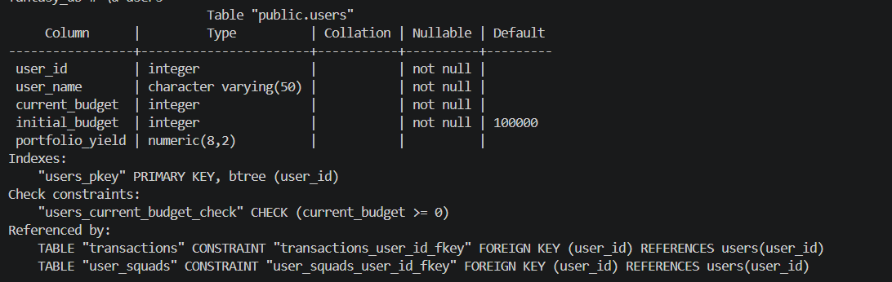
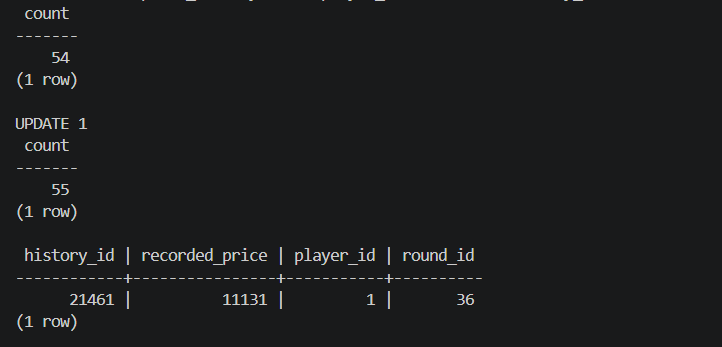

# דוח הפרויקט — שלב ד': תכנות (PL/pgSQL)

**מגישים:** אביאל כהן, נתנאל דהן

בשלב זה נכתבו תוכניות PL/pgSQL על גבי בסיס הנתונים המורחב משלב ג' (בורסת השחקנים + המערכת שהתקבלה + טבלת הגישור `PLAYER_MAPPING`). כל התוכניות הורצו בפועל מול בסיס הנתונים המקומי, כולל הוכחות הרצה (פלט `RAISE NOTICE` / שינויים בפועל בטבלאות).

---

## 0. שינוי סכמה — AlterTable.sql

לצורך תמיכה בחישוב תשואת סגל, הועשרה טבלת `USERS` בשתי עמודות:

```sql
ALTER TABLE USERS ADD COLUMN Initial_Budget INT NOT NULL DEFAULT 100000;
ALTER TABLE USERS ADD COLUMN Portfolio_Yield NUMERIC(8,2);
```

- **Initial_Budget** — התקציב ההתחלתי הקבוע של כל משתמש (ברירת מחדל אחידה 100,000), משמש בסיס לחישוב תשואה.
- **Portfolio_Yield** — אחוז התשואה הנוכחי, מחושב ומתעדכן ע"י `fn_calculate_portfolio_value`.

**הוכחת הרצה:**



---

## 1. טריגר 1 — trg_players_price_history (AFTER UPDATE)

**תיאור מילולי:** בכל עדכון של `PLAYERS.Current_Price`, הטריגר יוצר אוטומטית רשומה חדשה ב-`PRICE_HISTORY` עם המחיר החדש והסבב הפעיל (Active), עם נפילה לסבב האחרון אם אין סבב פעיל. כך אין צורך שכל תוכנית שמעדכנת מחיר "תזכור" לתעד את ההיסטוריה בנפרד — התיעוד מרוכז ברמת בסיס הנתונים.

```sql
CREATE OR REPLACE FUNCTION fn_trg_log_price_history()
RETURNS TRIGGER AS $$
DECLARE
    v_round_id PRICE_HISTORY.Round_ID%TYPE;
BEGIN
    IF NEW.Current_Price IS DISTINCT FROM OLD.Current_Price THEN
        SELECT Round_ID INTO v_round_id
        FROM ROUNDS WHERE Status = 'Active'
        ORDER BY Round_Number DESC LIMIT 1;

        IF v_round_id IS NULL THEN
            SELECT Round_ID INTO v_round_id
            FROM ROUNDS ORDER BY Round_Number DESC LIMIT 1;
        END IF;

        IF v_round_id IS NULL THEN
            RAISE EXCEPTION 'לא ניתן לתעד היסטוריית מחיר: לא קיים אף סבב בטבלת ROUNDS';
        END IF;

        INSERT INTO PRICE_HISTORY (History_ID, Recorded_Price, Player_ID, Round_ID)
        VALUES ((SELECT COALESCE(MAX(History_ID), 0) + 1 FROM PRICE_HISTORY),
                NEW.Current_Price, NEW.Player_ID, v_round_id);
    END IF;
    RETURN NEW;
END;
$$ LANGUAGE plpgsql;

CREATE TRIGGER trg_players_price_history
AFTER UPDATE ON PLAYERS
FOR EACH ROW
EXECUTE FUNCTION fn_trg_log_price_history();
```

**הוכחת הרצה:**



---

## 2. טריגר 2 — trg_transactions_validate (BEFORE INSERT)

**תיאור מילולי:** הגנה כפולה (Defense in Depth) ברמת בסיס הנתונים, בנוסף לבדיקות הקיימות ב-`server/index.js`. לפני כל הכנסת עסקה: ב-BUY בודק תקציב מספיק; ב-SELL בודק בעלות בפועל על השחקן. הפרה זורקת `RAISE EXCEPTION` ועוצרת את ה-INSERT.

```sql
CREATE OR REPLACE FUNCTION fn_trg_validate_transaction()
RETURNS TRIGGER AS $$
DECLARE
    v_budget    USERS.Current_Budget%TYPE;
    v_owns_cnt  INT;
BEGIN
    IF NEW.Action_Type = 'BUY' THEN
        SELECT Current_Budget INTO v_budget FROM USERS WHERE User_ID = NEW.User_ID;
        IF NOT FOUND THEN
            RAISE EXCEPTION 'משתמש % אינו קיים במערכת', NEW.User_ID;
        ELSIF v_budget < NEW.Transaction_Price THEN
            RAISE EXCEPTION 'תקציב לא מספיק למשתמש % (תקציב: %, מחיר עסקה: %)',
                NEW.User_ID, v_budget, NEW.Transaction_Price;
        END IF;
    ELSIF NEW.Action_Type = 'SELL' THEN
        SELECT COUNT(*) INTO v_owns_cnt FROM USER_SQUADS
        WHERE User_ID = NEW.User_ID AND Player_ID = NEW.Player_ID;
        IF v_owns_cnt = 0 THEN
            RAISE EXCEPTION 'משתמש % אינו מחזיק בשחקן % - לא ניתן למכור', NEW.User_ID, NEW.Player_ID;
        END IF;
    ELSE
        RAISE EXCEPTION 'סוג פעולה לא מוכר: %', NEW.Action_Type;
    END IF;
    RETURN NEW;
END;
$$ LANGUAGE plpgsql;

CREATE TRIGGER trg_transactions_validate
BEFORE INSERT ON TRANSACTIONS
FOR EACH ROW
EXECUTE FUNCTION fn_trg_validate_transaction();
```

**הוכחת הרצה (שתי חריגות):**


---

## 3. פונקציה 1 — fn_calculate_portfolio_value

**תיאור מילולי:** מקבלת `User_ID`, עוברת (Cursor מפורש) על כל השחקנים בסגל המשתמש וסוכמת את שווים לפי מחיר נוכחי (`squad_value`). מחשבת שווי כולל (`total_value = squad_value + Current_Budget`) ואחוז תשואה ביחס ל-`Initial_Budget`. מעדכנת (DML) את `USERS.Portfolio_Yield`, ומחזירה רשומה (RECORD מסוג `t_portfolio_result`) עם כל נתוני הביניים. זורקת חריגה אם המשתמש לא קיים.

```sql
CREATE TYPE t_portfolio_result AS (
    user_id INT, user_name VARCHAR, current_budget INT,
    squad_value INT, total_value INT, initial_budget INT, yield_percent NUMERIC
);

CREATE OR REPLACE FUNCTION fn_calculate_portfolio_value(p_user_id INT)
RETURNS t_portfolio_result AS $$
DECLARE
    v_user       USERS%ROWTYPE;
    v_squad_value INT := 0;
    v_total_value INT;
    v_yield      NUMERIC(8,2);
    v_result     t_portfolio_result;
    c_squad CURSOR FOR
        SELECT p.Current_Price FROM USER_SQUADS us
        JOIN PLAYERS p ON p.Player_ID = us.Player_ID
        WHERE us.User_ID = p_user_id;
    v_price PLAYERS.Current_Price%TYPE;
BEGIN
    SELECT * INTO v_user FROM USERS WHERE User_ID = p_user_id;
    IF NOT FOUND THEN
        RAISE EXCEPTION 'משתמש % אינו קיים במערכת', p_user_id;
    END IF;

    OPEN c_squad;
    LOOP
        FETCH c_squad INTO v_price;
        EXIT WHEN NOT FOUND;
        v_squad_value := v_squad_value + v_price;
    END LOOP;
    CLOSE c_squad;

    v_total_value := v_squad_value + v_user.Current_Budget;

    IF v_user.Initial_Budget = 0 THEN
        v_yield := 0;
    ELSE
        v_yield := ROUND((v_total_value - v_user.Initial_Budget)::NUMERIC
                          / v_user.Initial_Budget * 100, 2);
    END IF;

    UPDATE USERS SET Portfolio_Yield = v_yield WHERE User_ID = p_user_id;

    v_result := (p_user_id, v_user.User_Name, v_user.Current_Budget,
                 v_squad_value, v_total_value, v_user.Initial_Budget, v_yield);
    RETURN v_result;
EXCEPTION
    WHEN OTHERS THEN
        IF c_squad%ISOPEN THEN CLOSE c_squad; END IF;
        RAISE;
END;
$$ LANGUAGE plpgsql;
```

**הוכחת הרצה:**


---

## 4. פונקציה 2 — fn_get_user_transactions (REF CURSOR)

**תיאור מילולי:** מקבלת `User_ID`, ומחזירה **REF CURSOR** פתוח על היסטוריית העסקאות שלו (JOIN ל-`PLAYERS` לשם השחקן), ממוין מהחדש לישן. מדגימה החזרת REF CURSOR מפונקציה — הקוד הקורא אחראי למשוך (FETCH) את התוצאות בעצמו.

```sql
CREATE OR REPLACE FUNCTION fn_get_user_transactions(p_user_id INT)
RETURNS REFCURSOR AS $$
DECLARE
    v_cursor REFCURSOR := 'user_tx_cursor';
    v_exists INT;
BEGIN
    SELECT COUNT(*) INTO v_exists FROM USERS WHERE User_ID = p_user_id;
    IF v_exists = 0 THEN
        RAISE EXCEPTION 'משתמש % אינו קיים במערכת', p_user_id;
    END IF;

    OPEN v_cursor FOR
        SELECT t.Transaction_ID, t.Transaction_Time, t.Action_Type, t.Transaction_Price,
               p.First_Name || ' ' || p.Last_Name AS Player_Name
        FROM TRANSACTIONS t
        JOIN PLAYERS p ON p.Player_ID = t.Player_ID
        WHERE t.User_ID = p_user_id
        ORDER BY t.Transaction_Time DESC;

    RETURN v_cursor;
END;
$$ LANGUAGE plpgsql;
```

**הוכחת הרצה** (חייב להתבצע בתוך טרנזקציה מפורשת):


---

## 5. פרוצדורה 1 — prc_process_round_price_update

**תיאור מילולי:** מדמה "סגירת מחזור" — מעדכנת את מחירי כל שחקני הבורסה בהתבסס על **ביצועים אמיתיים** מהמערכת שהתקבלה בשלב ג', דרך טבלת הגישור `PLAYER_MAPPING`. Cursor מפורש עובר על כל שחקן, מחשב ציון ביצועים מצטבר (`goals*300 + assists*150 + tackles*20` מתוך `PLAYERMATCHSTATS`), ומשווה לממוצע הכללי (Cursor מרומז). שחקן מעל הממוצע — מחירו עולה; מתחתיו — יורד, מוגבל ל-±20% ולטווח החוקי 4,000-20,000. מבצעת **רק** `UPDATE` על `PLAYERS` — טבלת `PRICE_HISTORY` מתעדכנת אוטומטית ע"י טריגר 1 (הפרדת אחריות).

```sql
CREATE OR REPLACE PROCEDURE prc_process_round_price_update()
LANGUAGE plpgsql
AS $$
DECLARE
    v_avg_score     NUMERIC;
    v_pct_change    NUMERIC;
    v_new_price     INT;
    v_updated_count INT := 0;
    c_players CURSOR FOR
        SELECT b.Player_ID, b.Current_Price,
               COALESCE(SUM(pms.goals),   0) * 300 +
               COALESCE(SUM(pms.assists), 0) * 150 +
               COALESCE(SUM(pms.tackles), 0) * 20  AS perf_score
        FROM PLAYERS b
        JOIN PLAYER_MAPPING m ON m.bursa_player_id = b.Player_ID
        LEFT JOIN PLAYERMATCHSTATS pms ON pms.playerid = m.real_player_id
        GROUP BY b.Player_ID, b.Current_Price;
    v_rec RECORD;
BEGIN
    SELECT AVG(perf_score) INTO v_avg_score FROM (
        SELECT COALESCE(SUM(pms.goals),0)*300 + COALESCE(SUM(pms.assists),0)*150
               + COALESCE(SUM(pms.tackles),0)*20 AS perf_score
        FROM PLAYERS b
        JOIN PLAYER_MAPPING m ON m.bursa_player_id = b.Player_ID
        LEFT JOIN PLAYERMATCHSTATS pms ON pms.playerid = m.real_player_id
        GROUP BY b.Player_ID
    ) sub;

    IF v_avg_score IS NULL OR v_avg_score = 0 THEN
        RAISE EXCEPTION 'לא ניתן לחשב ממוצע ביצועים - אין נתוני PLAYERMATCHSTATS ממופים';
    END IF;

    OPEN c_players;
    LOOP
        FETCH c_players INTO v_rec;
        EXIT WHEN NOT FOUND;

        v_pct_change := (v_rec.perf_score - v_avg_score) / v_avg_score * 0.2;
        IF v_pct_change > 0.2 THEN v_pct_change := 0.2;
        ELSIF v_pct_change < -0.2 THEN v_pct_change := -0.2;
        END IF;

        v_new_price := ROUND(v_rec.Current_Price * (1 + v_pct_change));
        IF v_new_price < 4000 THEN v_new_price := 4000;
        ELSIF v_new_price > 20000 THEN v_new_price := 20000;
        END IF;

        UPDATE PLAYERS SET Current_Price = v_new_price WHERE Player_ID = v_rec.Player_ID;
        v_updated_count := v_updated_count + 1;
    END LOOP;
    CLOSE c_players;

    RAISE NOTICE 'סגירת מחזור הושלמה: % שחקנים עודכנו (ממוצע ביצועים: %)',
        v_updated_count, ROUND(v_avg_score, 1);
EXCEPTION
    WHEN OTHERS THEN
        IF c_players%ISOPEN THEN CLOSE c_players; END IF;
        RAISE;
END;
$$;
```

**הוכחת הרצה** (מחירי שחקנים 1-3 לפני/אחרי, ספירת PRICE_HISTORY לפני/אחרי, וה-NOTICE):


---

## 6. פרוצדורה 2 — prc_execute_trade

**תיאור מילולי:** מבצעת עסקת קנייה/מכירה שלמה עבור משתמש ושחקן. שולפת (Cursor מרומז) את מחיר השחקן, ומנסה להכניס רשומה ל-`TRANSACTIONS` בתוך בלוק מקונן — כאן טריגר 2 עשוי לזרוק חריגה (תקציב לא מספיק / אין בעלות). הפרוצדורה תופסת חריגה זו, מדפיסה הודעה (`RAISE NOTICE`) ועוצרת בלי לקרוס. אם ה-INSERT הצליח, מבצעת בפועל את החישוב הכלכלי — עדכון תקציב ועדכון סגל (BUY/SELL, הסתעפות).

```sql
CREATE OR REPLACE PROCEDURE prc_execute_trade(
    p_user_id INT, p_player_id INT, p_action_type VARCHAR
)
LANGUAGE plpgsql
AS $$
DECLARE
    v_price    PLAYERS.Current_Price%TYPE;
    v_tx_id    INT;
    v_squad_id INT;
BEGIN
    SELECT Current_Price INTO v_price FROM PLAYERS WHERE Player_ID = p_player_id;
    IF NOT FOUND THEN
        RAISE EXCEPTION 'שחקן % אינו קיים במערכת', p_player_id;
    END IF;

    v_tx_id := (SELECT COALESCE(MAX(Transaction_ID), 0) + 1 FROM TRANSACTIONS);

    BEGIN
        INSERT INTO TRANSACTIONS (Transaction_ID, Transaction_Time, Action_Type,
                                   Transaction_Price, User_ID, Player_ID)
        VALUES (v_tx_id, NOW(), UPPER(p_action_type), v_price, p_user_id, p_player_id);
    EXCEPTION
        WHEN OTHERS THEN
            RAISE NOTICE 'העסקה נדחתה ע"י בסיס הנתונים: %', SQLERRM;
            RETURN;
    END;

    IF UPPER(p_action_type) = 'BUY' THEN
        UPDATE USERS SET Current_Budget = Current_Budget - v_price WHERE User_ID = p_user_id;
        v_squad_id := (SELECT COALESCE(MAX(Squad_Record_ID), 0) + 1 FROM USER_SQUADS);
        INSERT INTO USER_SQUADS (Squad_Record_ID, Lineup_Status, User_ID, Player_ID)
        VALUES (v_squad_id, 'Bench', p_user_id, p_player_id);
        RAISE NOTICE 'קנייה בוצעה בהצלחה: משתמש % קנה שחקן % במחיר %', p_user_id, p_player_id, v_price;
    ELSIF UPPER(p_action_type) = 'SELL' THEN
        UPDATE USERS SET Current_Budget = Current_Budget + v_price WHERE User_ID = p_user_id;
        DELETE FROM USER_SQUADS WHERE User_ID = p_user_id AND Player_ID = p_player_id;
        RAISE NOTICE 'מכירה בוצעה בהצלחה: משתמש % מכר שחקן % במחיר %', p_user_id, p_player_id, v_price;
    ELSE
        RAISE EXCEPTION 'סוג פעולה לא תקין: %', p_action_type;
    END IF;
END;
$$;
```

**הוכחת הרצה — מקרה הצלחה:**


**הוכחת הרצה — מקרה כישלון (הטריגר עוצר את הפרוצדורה):**


---

## 7. תוכנית ראשית 1 — תשואת סגל + עסקת קנייה

**תיאור מילולי:** בלוק אנונימי (`DO $$ ... END $$`) שקורא ל-`fn_calculate_portfolio_value` (פונקציה) לפני ואחרי קריאה ל-`prc_execute_trade` (פרוצדורה) — מדגים שקנייה בפועל משנה את התקציב/שווי הסגל, אך לא את השווי הכולל (הכסף רק "עובר צורה").

```sql
DO $$
DECLARE
    v_result t_portfolio_result;
BEGIN
    RAISE NOTICE '=== תוכנית ראשית 1: תשואת סגל + עסקת קנייה (משתמש 366) ===';
    v_result := fn_calculate_portfolio_value(366);
    RAISE NOTICE 'לפני הקנייה -> תקציב: % | שווי סגל: % | שווי כולל: % | תשואה: %',
        v_result.current_budget, v_result.squad_value, v_result.total_value, v_result.yield_percent || '%';

    CALL prc_execute_trade(366, 8, 'BUY');

    v_result := fn_calculate_portfolio_value(366);
    RAISE NOTICE 'אחרי הקנייה -> תקציב: % | שווי סגל: % | שווי כולל: % | תשואה: %',
        v_result.current_budget, v_result.squad_value, v_result.total_value, v_result.yield_percent || '%';
END $$;
```

**הוכחת הרצה בפועל:**


---

## 8. תוכנית ראשית 2 — סגירת מחזור + היסטוריית עסקאות

**תיאור מילולי:** בלוק אנונימי שקורא ל-`prc_process_round_price_update` (פרוצדורה) לעדכון כלל מחירי השוק, ולאחריו ל-`fn_get_user_transactions` (פונקציה) — מקבל REF CURSOR ומדגים מיצוי (`FETCH`) שלו בלולאה, עד 5 עסקאות אחרונות.

```sql
DO $$
DECLARE
    v_cursor REFCURSOR;
    v_rec    RECORD;
    v_count  INT := 0;
BEGIN
    RAISE NOTICE '=== תוכנית ראשית 2: סגירת מחזור + היסטוריית עסקאות (משתמש 366) ===';
    CALL prc_process_round_price_update();

    v_cursor := fn_get_user_transactions(366);
    LOOP
        FETCH v_cursor INTO v_rec;
        EXIT WHEN NOT FOUND;
        v_count := v_count + 1;
        RAISE NOTICE 'עסקה #% | % | שחקן: % | מחיר: %',
            v_rec."transaction_id", v_rec."action_type", v_rec."player_name", v_rec."transaction_price";
        EXIT WHEN v_count >= 5;
    END LOOP;
    CLOSE v_cursor;
    RAISE NOTICE 'סה"כ הוצגו % עסקאות אחרונות', v_count;
END $$;
```

**הוכחת הרצה בפועל:**


---

## 9. סיכום אלמנטי תכנות שנכללו

| אלמנט | היכן |
|---|---|
| Cursor מפורש | פונקציה 1 (`c_squad`), פרוצדורה 1 (`c_players`), תוכנית ראשית 2 (`v_cursor` עם FETCH) |
| Cursor מרומז (SELECT INTO) | טריגר 1, טריגר 2, פונקציה 1, פרוצדורה 1, פרוצדורה 2 |
| REF Cursor | פונקציה 2 (`fn_get_user_transactions`), נצרך בתוכנית ראשית 2 |
| פקודות DML | INSERT (טריגר 1, פרוצדורה 2), UPDATE (פרוצדורה 1, פרוצדורה 2, פונקציה 1), DELETE (פרוצדורה 2) |
| הסתעפויות | כל הטריגרים/פונקציות/פרוצדורות (IF/ELSIF/ELSE) |
| לולאות | פונקציה 1, פרוצדורה 1, תוכנית ראשית 2 |
| Exception | כל שש התוכניות (RAISE EXCEPTION / EXCEPTION WHEN OTHERS) |
| רשומות (Records) | `t_portfolio_result` (טיפוס מותאם), `USERS%ROWTYPE`, `RECORD` (בפרוצדורה 1 ותוכנית 2) |

---

