# פנטזי ליג — דוח פרויקט שלב א'

---

## שער

**מגישים:** אביאל כהן, נתנאל דהן

**שם המערכת:** פנטזי ליג

**היחידה הנבחרת:** בורסת השחקנים של הליגה

---

## תוכן עניינים

1. [מבוא](#מבוא)
2. [מסכי המערכת — AI Studio](#מסכי-המערכת--ai-studio)
3. [תרשימי ERD ו-DSD](#תרשימי-erd-ו-dsd)
4. [תיאור הנתונים](#תיאור-הנתונים)
5. [מילון נתונים](#מילון-נתונים)
6. [פונקציונאליות עיקרית](#פונקציונאליות-עיקרית)
7. [מבנה בסיס הנתונים](#מבנה-בסיס-הנתונים)
8. [מבנה תיקיות הפרויקט](#מבנה-תיקיות-הפרויקט)
9. [שיטות הכנסת הנתונים](#שיטות-הכנסת-הנתונים)
10. [גיבוי ושחזור](#גיבוי-ושחזור)
11. [הוראות הרצה](#הוראות-הרצה)

---

## מבוא

פנטזי ליג היא מערכת המדמה בורסת שחקנים בליגת הכדורגל הישראלית.
כל משתמש מתחיל עם תקציב התחלתי ויכול לקנות ולמכור שחקנים בהתאם לביצועיהם בשטח.
ערך כל שחקן משתנה מסבב לסבב בהתאם לנתוניו, בדומה למניה בשוק ההון.

המערכת שומרת את פרטי השחקנים, היסטוריית המחירים לאורך עונה שלמה (36 סבבים), עסקאות הקנייה והמכירה של כל משתמש, והרכב הסגל האישי שלו.

המטרה היא לאפשר למשתמש לנהל תיק השקעות וירטואלי של שחקנים, לעקוב אחר רווח והפסד, ולקבל החלטות קנייה ומכירה מושכלות.

---

## מסכי המערכת — AI Studio

ממשק המשתמש של המערכת עוצב ונוצר בעזרת **Google AI Studio**.
הממשק כולל 4 מסכים עיקריים:

1. **שוק השחקנים** — רשימת כל השחקנים הזמינים לקנייה עם אפשרות סינון לפי עמדה וחיפוש לפי שם
2. **פרופיל שחקן** — דף מפורט לכל שחקן עם סטטיסטיקות וגרף היסטוריית מחיר
3. **הסגל שלי** — ניהול הרכב אישי עם חישוב רווח/הפסד לכל שחקן
4. **היסטוריית עסקאות** — לוג מלא של כל פעולות הקנייה והמכירה

> [!TIP]
> **קישור לאפליקציה ב-Google AI Studio:** [בורסת השחקנים - פנטזי ליג](https://ai.studio/apps/46cbc314-4ef9-41cd-84d4-4cb8117e9d5a)

> צילומי מסך מה-AI Studio יתווספו כאן

---

## תרשימי ERD ו-DSD

### ERD


### DSD


---

## תיאור הנתונים

המערכת מנהלת שישה סוגי ישויות מרכזיות:

### משתמשים (USERS)
כל משתמש מזוהה בשם ייחודי ומחזיק תקציב נוכחי. התקציב מתעדכן בכל קנייה או מכירה של שחקן ואינו יכול לרדת מאפס.

### שחקנים (PLAYERS)
כל שחקן מוגדר לפי שם, עמדה (שוער / מגן / קשר / חלוץ), שם הקבוצה שבה הוא משחק, ומחיר עדכני. המחיר נע בטווח קבוע בין 4,000 ל-20,000 יחידות.

### סבבים (ROUNDS)
עונה מורכבת מ-36 סבבים. כל סבב מוגדר בתאריכי התחלה וסיום ובסטטוס שלו (עתידי / פעיל / הסתיים). הסבבים מהווים את ציר הזמן שלפיו מתעדכנים מחירי השחקנים.

### היסטוריית מחירים (PRICE_HISTORY)
לכל שחקן נשמר המחיר שנרשם עבורו בכל סבב. כך ניתן לעקוב אחר מגמות עלייה וירידה בערך השחקן לאורך כל העונה.

### עסקאות (TRANSACTIONS)
כל פעולת קנייה או מכירה של שחקן על ידי משתמש נרשמת עם חותמת זמן, סוג הפעולה, מחיר הביצוע, זהות המשתמש והשחקן. הטבלה מהווה לוג מלא של כל פעילות המסחר.

### סגל אישי (USER_SQUADS)
לכל משתמש ייתכנו מספר שחקנים בסגל. כל שחקן בסגל מוגדר כמחליף (Bench) או שחקן פותח (Starter).

---

## מילון נתונים

### USERS — משתמשים

**מטרה:** שמירת פרטי המשתמשים הרשומים במערכת וניהול התקציב שלהם.

| שם שדה | טיפוס | אילוצים | תיאור |
|--------|--------|---------|-------|
| User_ID | INT | PK, NOT NULL | מזהה ייחודי לכל משתמש |
| User_Name | VARCHAR(50) | NOT NULL | שם המשתמש |
| Current_Budget | INT | NOT NULL, >= 0 | תקציב נוכחי — מתעדכן בכל עסקה |

**קשרים:** משתמש יכול לבצע עסקאות רבות (1:N עם TRANSACTIONS), ויכול להחזיק שחקנים רבים בסגל (1:N עם USER_SQUADS).

---

### PLAYERS — שחקנים

**מטרה:** שמירת פרטי השחקנים הזמינים לסחר בבורסה.

| שם שדה | טיפוס | אילוצים | תיאור |
|--------|--------|---------|-------|
| Player_ID | INT | PK, NOT NULL | מזהה ייחודי לכל שחקן |
| First_Name | VARCHAR(50) | NOT NULL | שם פרטי |
| Last_Name | VARCHAR(50) | NOT NULL | שם משפחה |
| Position | VARCHAR(20) | NOT NULL, IN ('Goalkeeper','Defender','Midfielder','Attacker') | עמדת השחקן |
| Team_Name | VARCHAR(50) | NOT NULL | שם הקבוצה |
| Current_Price | INT | NOT NULL, 4000–20000 | מחיר עדכני בבורסה |

**קשרים:** שחקן מופיע בעסקאות (1:N עם TRANSACTIONS), בהיסטוריית מחירים (1:N עם PRICE_HISTORY), ובסגלי משתמשים (1:N עם USER_SQUADS).

---

### ROUNDS — סבבים

**מטרה:** ייצוג סבבי העונה — ציר הזמן שלפיו מתעדכנים מחירי השחקנים.

| שם שדה | טיפוס | אילוצים | תיאור |
|--------|--------|---------|-------|
| Round_ID | INT | PK, NOT NULL | מזהה ייחודי לסבב |
| Round_Number | INT | NOT NULL, 1–36 | מספר הסבב בעונה |
| Start_Date | TIMESTAMP | NOT NULL | תאריך ושעת תחילת הסבב |
| End_Date | TIMESTAMP | NOT NULL, > Start_Date | תאריך ושעת סיום הסבב |
| Status | VARCHAR(20) | NOT NULL, IN ('Upcoming','Active','Completed') | סטטוס הסבב |

**קשרים:** לכל סבב ייתכנו רשומות רבות בהיסטוריית המחירים (1:N עם PRICE_HISTORY).

---

### PRICE_HISTORY — היסטוריית מחירים

**מטרה:** תיעוד מחיר כל שחקן בכל סבב — מאפשר מעקב אחר מגמות לאורך העונה.

| שם שדה | טיפוס | אילוצים | תיאור |
|--------|--------|---------|-------|
| History_ID | INT | PK, NOT NULL | מזהה ייחודי לרשומה |
| Recorded_Price | INT | NOT NULL, 4000–20000 | המחיר שנרשם לשחקן בסבב זה |
| Player_ID | INT | FK → PLAYERS, NOT NULL | השחקן שאליו שייכת הרשומה |
| Round_ID | INT | FK → ROUNDS, NOT NULL | הסבב שבו נרשם המחיר |

**קשרים:** ישות מקשרת בין PLAYERS ל-ROUNDS (M:N).

---

### TRANSACTIONS — עסקאות

**מטרה:** לוג מלא של כל פעולות הקנייה והמכירה של שחקנים על ידי משתמשים.

| שם שדה | טיפוס | אילוצים | תיאור |
|--------|--------|---------|-------|
| Transaction_ID | INT | PK, NOT NULL | מזהה ייחודי לעסקה |
| Transaction_Time | TIMESTAMP | NOT NULL | חותמת זמן של ביצוע העסקה |
| Action_Type | VARCHAR(10) | NOT NULL, IN ('BUY','SELL') | סוג הפעולה |
| Transaction_Price | INT | NOT NULL, 4000–20000 | מחיר ביצוע העסקה |
| User_ID | INT | FK → USERS, NOT NULL | המשתמש שביצע את העסקה |
| Player_ID | INT | FK → PLAYERS, NOT NULL | השחקן שנסחר |

**קשרים:** ישות מקשרת בין USERS ל-PLAYERS (M:N).

---

### USER_SQUADS — סגל אישי

**מטרה:** ניהול הרכב הסגל האישי של כל משתמש — אילו שחקנים בבעלותו ומה סטטוסם.

| שם שדה | טיפוס | אילוצים | תיאור |
|--------|--------|---------|-------|
| Squad_Record_ID | INT | PK, NOT NULL | מזהה ייחודי לרשומת הסגל |
| Lineup_Status | VARCHAR(20) | NOT NULL, IN ('Starter','Bench') | האם שחקן פותח או מחליף |
| User_ID | INT | FK → USERS, NOT NULL | המשתמש הבעלים |
| Player_ID | INT | FK → PLAYERS, NOT NULL | השחקן בסגל |

**קשרים:** ישות מקשרת בין USERS ל-PLAYERS (M:N).

---

## פונקציונאליות עיקרית

- **מסחר בשחקנים** — קנייה ומכירה של שחקנים תוך עדכון תקציב המשתמש בזמן אמת
- **ניהול סגל אישי** — הרכבת קבוצה אישית ושיבוץ שחקנים להרכב הפותח או ספסל החילופים
- **מעקב מחירים** — צפייה בהיסטוריית מחיר של כל שחקן לאורך סבבי העונה
- **היסטוריית עסקאות** — תיעוד מלא של כל פעולות המסחר עם מועד וסכום לכל עסקה
- **ניהול תקציב** — מעקב אחר יתרת התקציב ומניעת חריגה לחובה

---

## מבנה בסיס הנתונים

```
USERS
├── User_ID        INT  (PK)
├── User_Name      VARCHAR(50)
└── Current_Budget INT  (>= 0)

PLAYERS
├── Player_ID      INT  (PK)
├── First_Name     VARCHAR(50)
├── Last_Name      VARCHAR(50)
├── Position       VARCHAR(20)  ('Goalkeeper' | 'Defender' | 'Midfielder' | 'Attacker')
├── Team_Name      VARCHAR(50)
└── Current_Price  INT  (4000-20000)

ROUNDS
├── Round_ID       INT  (PK)
├── Round_Number   INT  (1-36)
├── Start_Date     TIMESTAMP
├── End_Date       TIMESTAMP
└── Status         VARCHAR(20)  ('Upcoming' | 'Active' | 'Completed')

PRICE_HISTORY
├── History_ID     INT  (PK)
├── Recorded_Price INT  (4000-20000)
├── Player_ID      INT  (FK -> PLAYERS)
└── Round_ID       INT  (FK -> ROUNDS)

TRANSACTIONS
├── Transaction_ID    INT  (PK)
├── Transaction_Time  TIMESTAMP
├── Action_Type       VARCHAR(10)  ('BUY' | 'SELL')
├── Transaction_Price INT  (4000-20000)
├── User_ID           INT  (FK -> USERS)
└── Player_ID         INT  (FK -> PLAYERS)

USER_SQUADS
├── Squad_Record_ID  INT  (PK)
├── Lineup_Status    VARCHAR(20)  ('Starter' | 'Bench')
├── User_ID          INT  (FK -> USERS)
└── Player_ID        INT  (FK -> PLAYERS)
```

**נתוני הזרעה (Seed Data):**

| טבלה | כמות רשומות |
|------|-------------|
| USERS | 500 |
| PLAYERS | 500 |
| ROUNDS | 504 |
| TRANSACTIONS | 20,000 |
| PRICE_HISTORY | 20,000 |
| USER_SQUADS | 500 |

---

## מבנה תיקיות הפרויקט

```
db-project-ui/ (שורש ה-Repository)
│
├── DBProject_4072_3817/        # תיקיית ההגשה הרשמית (תעודות זהות)
│   └── שלב א/
│       ├── system_specification.md # איפיון המערכת - Google AI Studio
│       ├── ERD.png             # קובץ ERD
│       ├── DSD.png             # קובץ DSD
│       ├── createTables.sql    # סקריפט DDL ליצירת טבלאות
│       ├── dropTables.sql      # סקריפט DDL למחיקת טבלאות
│       ├── insertTables.sql    # סקריפט אכלוס נתונים מלא (41,500+ שורות)
│       ├── selectAll.sql       # שאילתות בדיקה לכל הטבלאות
│       ├── backup_2026-06-08.sql # קובץ גיבוי בסיס הנתונים
│       │
│       ├── Manual/             # שיטת אכלוס 1: ידנית (סבבים)
│       │   └── ROUNDS.sql
│       │
│       ├── mockarooFiles/      # שיטת אכלוס 2: אתר Mockaroo (משתמשים ושחקנים)
│       │   ├── USERS.sql
│       │   └── PLAYERS.sql
│       │
│       └── Programing/         # שיטת אכלוס 3: קוד פייתון (עסקאות, היסטוריית מחירים וסגלים)
│           ├── generate_massive_data.py
│           └── massive_inserts.sql
│
├── src/                        # קוד ממשק המשתמש (React + TypeScript)
│   ├── App.tsx                 # הרכיב הראשי — כל לוגיקת הממשק
│   ├── main.tsx                # נקודת כניסה
│   └── index.css               # סגנונות
│
├── init-db/                    # סקריפטי אתחול מקוריים של Docker
│   ├── 01_drop.sql
│   ├── 02_create.sql
│   ├── 03_players.sql
│   ├── 04_rounds.sql
│   ├── 05_users.sql
│   ├── 06_transactions.sql
│   ├── 07_price_history.sql
│   ├── 08_user_squads.sql
│   └── generate_massive_data.py
│
├── images/                     # תמונות לדוח
│   ├── ERD.png
│   ├── DSD.png
│   ├── mockaroo.png
│   ├── pyton script.png
│   ├── ROUND INSERT.png
│   ├── backup command (1 method).png
│   ├── backup success (1 method).png
│   └── backup success (2 method).png
│
├── docker-compose.yml          # הגדרות Docker (PostgreSQL + PgAdmin)
├── .env                        # משתני סביבה (סיסמאות, שם DB)
└── README.md                   # דוח הפרויקט
```

**הערה לשותף:** הקבצים ב-`init-db/` רצים אוטומטית לפי סדר מספרי כאשר מריצים `docker-compose up -d` בפעם הראשונה. אם כבר הרצת בעבר ורוצה לאפס — הרץ `docker-compose down -v` ואז `docker-compose up -d` מחדש.

---

## שיטות הכנסת הנתונים

השתמשנו בשלוש שיטות שונות להכנסת הנתונים לבסיס הנתונים:

---

### שיטה 1 — הכנסה ידנית עם פקודות INSERT (תיקייה: `DBProject/שלב א/`)

נתוני **ROUNDS** (504 סבבים) הוכנסו ישירות בכתיבת פקודות `INSERT` ידניות לתוך קובץ SQL.
בחרנו בשיטה זו כי לסבבים יש מבנה קבוע ומסודר — תאריכי התחלה וסיום לפי לוח המשחקים, ומספר סבב עולה — שקל לכתוב ולשלוט בו ידנית.

קבצים רלוונטיים: `createTables.sql`, `dropTables.sql`, `selectAll.sql`


---

### שיטה 2 — אתר mockaroo (תיקייה: `DBProject/שלב א/mockarooFiles/`)

נתוני **USERS** ו-**PLAYERS** (500 רשומות כל אחד) נוצרו באמצעות האתר **[mockaroo.com](https://mockaroo.com)**.
הגדרנו בממשק האתר את שמות העמודות, הטיפוסים והאילוצים, ויצאנו קובץ SQL מוכן עם 500 שורות `INSERT` לכל טבלה.

קבצים שנוצרו: `USERS.sql`, `PLAYERS.sql`


---

### שיטה 3 — סקריפט Python (תיקייה: `DBProject/שלב א/Programing/`)

הנתונים הגדולים — **TRANSACTIONS**, **PRICE_HISTORY** ו-**USER_SQUADS** (סה"כ 40,500 רשומות) — נוצרו באמצעות סקריפט Python שכתבנו: `generate_massive_data.py`.

הסקריפט רץ על המחשב המקומי ויצר ישירות קובץ SQL עם פקודות INSERT.

**איך עובד הסקריפט:**
- מגריל תאריכים אקראיים בין 2012 להיום לכל עסקה
- מגריל סוג פעולה (BUY/SELL), מחיר בין 4,000-20,000, ומזהי משתמש ושחקן
- כותב את כל הרשומות כ-`INSERT` אחד גדול לביצועים מיטביים
- מייצר 20,000 עסקאות, 20,000 רשומות היסטוריית מחירים, ו-500 רשומות סגל

```python
# הרצת הסקריפט
python generate_massive_data.py
# פלט: massive_inserts.sql עם 40,500 רשומות
```


---

## גיבוי ושחזור

ביצענו שתי שיטות גיבוי שונות לבסיס הנתונים `fantasy_db`.

**מה נשמר בקובץ הגיבוי?**
קובץ הגיבוי מכיל את כל מה שנחוץ לשחזור מלא של בסיס הנתונים:
- פקודות `CREATE TABLE` עם כל האילוצים וה-FK
- פקודות `INSERT` עם כל הנתונים (500 משתמשים, 500 שחקנים, 20,000 עסקאות וכו')
- הרשאות והגדרות סכמה

כלומר — מריצים את הקובץ על מחשב אחר ומקבלים בסיס נתונים זהה לחלוטין.

---

### שיטה 1 — שורת פקודה (`pg_dump`)

הרצנו את הפקודה הבאה בטרמינל:

```bash
docker exec PostgreSQL_DB pg_dump -U postgres fantasy_db > backup_2026-06-08.sql
```

.png)

.png)

---

### שיטה 2 — PgAdmin (ממשק גרפי)

גיבוי דרך ממשק PgAdmin: לחיצה ימנית על `fantasy_db` ← **Backup...** ← בחירת פורמט ושם קובץ.

.png)

---

## הוראות הרצה

### דרישות מוקדמות
- [Docker Desktop](https://www.docker.com/products/docker-desktop/)

### הפעלת בסיס הנתונים

```bash
docker-compose up -d
```

בסיס הנתונים יאותחל אוטומטית עם כל הטבלאות והנתונים.

### ממשק ניהול — PgAdmin

פתח דפדפן בכתובת **http://localhost:8080**

| שדה | ערך |
|-----|-----|
| Email | admin@admin.com |
| Password | admin |

לאחר הכניסה, הוסף שרת חדש עם הפרטים:

| שדה | ערך |
|-----|-----|
| Host | db |
| Port | 5432 |
| Database | fantasy_db |
| Username | postgres |
| Password | 123456 |

### הפעלת ממשק המשתמש (React)

```bash
npm install
npm run dev
```

הממשק יעלה בכתובת **http://localhost:5173**

---

# פנטזי ליג — דוח פרויקט שלב ב'

<div dir="rtl">

## 1. שאילתות SELECT

נכתבו 8 שאילתות SELECT מורכבות המבוססות על נתונים אמיתיים במסד הנתונים. מתוכן, 4 שאילתות נכתבו בשתי גרסאות שונות לצורך ניתוח ביצועים ויעילות.

### שאילתות SELECT כפולות (ניתוח יעילות)

#### שאילתה 1: שחקנים שמעולם לא נרכשו על ידי אף משתמש
* **תיאור**: שאילתה זו מוצאת את כל השחקנים בבורסה שלא קיימת עבורם אף עסקת רכישה (`Action_Type = 'BUY'`) בטבלת העסקאות.
* **גרסה א' (NOT IN)**:
  ```sql
  SELECT Player_ID, First_Name, Last_Name, Team_Name, Current_Price
  FROM PLAYERS
  WHERE Player_ID NOT IN (
      SELECT DISTINCT Player_ID 
      FROM TRANSACTIONS 
      WHERE Action_Type = 'BUY' AND Player_ID IS NOT NULL
  );
  ```
* **גרסה ב' (NOT EXISTS - מומלצת)**:
  ```sql
  SELECT p.Player_ID, p.First_Name, p.Last_Name, p.Team_Name, p.Current_Price
  FROM PLAYERS p
  WHERE NOT EXISTS (
      SELECT 1 
      FROM TRANSACTIONS t 
      WHERE t.Player_ID = p.Player_ID AND t.Action_Type = 'BUY'
  );
  ```
* **הסבר יעילות**: גרסה ב' (`NOT EXISTS`) יעילה משמעותית מגרסה א' (`NOT IN`). פקודת `NOT IN` דורשת סריקה מלאה של כל תוצאות תת-השאילתה והשוואה לכל שורה. כמו כן, במידה ואחת הרשומות בתת-השאילתה היא `NULL`, שאילתת `NOT IN` כולה תחזיר קבוצה ריקה (אלא אם מסננים זאת במפורש). לעומת זאת, `NOT EXISTS` מתנהג כ-Semi-Join ועוצר את הסריקה ברגע שנמצאת ההתאמה הראשונה לכל שחקן.

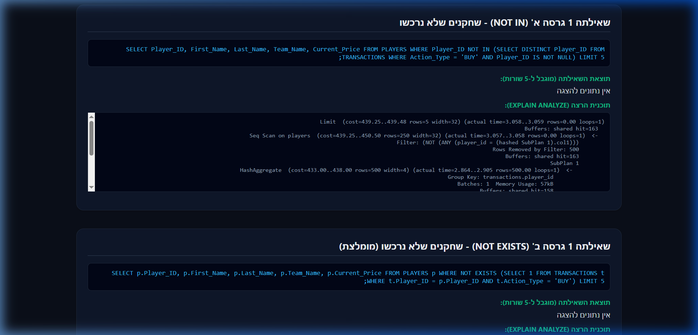

---

#### שאילתה 2: חמשת המשתמשים שהוציאו הכי הרבה כסף על רכישת שחקנים בשנת 2026
* **תיאור**: שאילתה זו סוכמת את מחירי העסקאות של כל משתמש עבור פעולות קנייה בשנת 2026 ומחזירה את חמשת המשתמשים המובילים.
* **גרסה א' (JOIN ו-GROUP BY - מומלצת)**:
  ```sql
  SELECT u.User_ID, u.User_Name, SUM(t.Transaction_Price) as Total_Spent
  FROM USERS u
  JOIN TRANSACTIONS t ON u.User_ID = t.User_ID
  WHERE t.Action_Type = 'BUY' AND t.Transaction_Time >= '2026-01-01 00:00:00'
  GROUP BY u.User_ID, u.User_Name
  ORDER BY Total_Spent DESC
  LIMIT 5;
  ```
* **גרסה ב' (Correlated Subquery ב-SELECT)**:
  ```sql
  SELECT u.User_ID, u.User_Name,
         (SELECT SUM(t.Transaction_Price) 
          FROM TRANSACTIONS t 
          WHERE t.User_ID = u.User_ID AND t.Action_Type = 'BUY' AND t.Transaction_Time >= '2026-01-01 00:00:00') as Total_Spent
  FROM USERS u
  WHERE (SELECT SUM(t.Transaction_Price) 
         FROM TRANSACTIONS t 
         WHERE t.User_ID = u.User_ID AND t.Action_Type = 'BUY' AND t.Transaction_Time >= '2026-01-01 00:00:00') IS NOT NULL
  ORDER BY Total_Spent DESC
  LIMIT 5;
  ```
* **הסבר יעילות**: גרסה א' (`JOIN` ו-`GROUP BY`) יעילה בהרבה. בגרסה ב', תת-השאילתה המקושרת (Correlated Subquery) מורצת פעמיים עבור **כל שורה ושורה** בטבלת המשתמשים (פעם אחת עבור העמודה ב-`SELECT` ופעם שנייה בסינון ה-`WHERE`). לעומת זאת, בגרסה א' מתבצע חיבור מרוכז (Hash Join או Merge Join) של שתי הטבלאות פעם אחת בלבד ולאחר מכן מתבצע הקיבוץ.

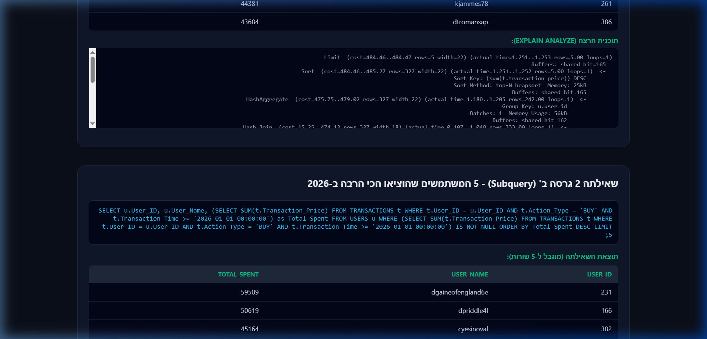

---

#### שאילתה 3: כמות היסטוריית המחירים לכל שחקן
* **תיאור**: ספירת כמות פעמים שבהן השתנה מחיר שוק של כל שחקן לאורך מחזורי הליגה.
* **גרסה א' (LEFT JOIN ו-GROUP BY - מומלצת)**:
  ```sql
  SELECT p.Player_ID, p.First_Name || ' ' || p.Last_Name as Player_Name, COUNT(ph.History_ID) as History_Count
  FROM PLAYERS p
  LEFT JOIN PRICE_HISTORY ph ON p.Player_ID = ph.Player_ID
  GROUP BY p.Player_ID, p.First_Name, p.Last_Name
  ORDER BY History_Count DESC
  LIMIT 10;
  ```
* **גרסה ב' (Correlated Subquery ב-SELECT)**:
  ```sql
  SELECT p.Player_ID, p.First_Name || ' ' || p.Last_Name as Player_Name,
         (SELECT COUNT(*) FROM PRICE_HISTORY ph WHERE ph.Player_ID = p.Player_ID) as History_Count
  FROM PLAYERS p
  ORDER BY History_Count DESC
  LIMIT 10;
  ```
* **הסבר יעילות**: בדומה לשאילתה הקודמת, שימוש ב-`LEFT JOIN` מאפשר למנוע האופטימיזציה לבצע סריקה יעילה ומקבילית של הטבלאות ולחבר אותן בבת אחת, בעוד שתת-שאילתה מקושרת מאלצת מעבר שורה-אחר-שורה (Nested Loop) אשר פוגע קשות בביצועים כאשר כמות השחקנים גדלה.

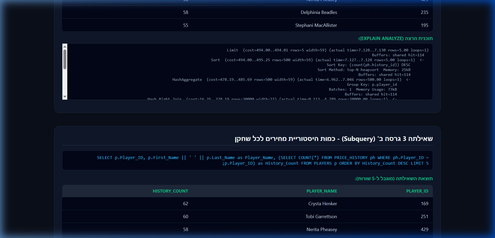

---

#### שאילתה 4: משתמשים שמחזיקים לפחות שחקן אחד מקבוצת 'Muxagata' בסגל שלהם
* **תיאור**: שאילתה זו מוצאת משתמשים שהרכיבו בסגל שלהם שחקן השייך לקבוצה הספציפית הזו.
* **גרסה א' (IN subquery)**:
  ```sql
  SELECT User_ID, User_Name, Current_Budget
  FROM USERS
  WHERE User_ID IN (
      SELECT DISTINCT us.User_ID
      FROM USER_SQUADS us
      JOIN PLAYERS p ON us.Player_ID = p.Player_ID
      WHERE p.Team_Name = 'Muxagata'
  );
  ```
* **גרסה ב' (EXISTS - מומלצת)**:
  ```sql
  SELECT u.User_ID, u.User_Name, u.Current_Budget
  FROM USERS u
  WHERE EXISTS (
      SELECT 1
      FROM USER_SQUADS us
      JOIN PLAYERS p ON us.Player_ID = p.Player_ID
      WHERE us.User_ID = u.User_ID AND p.Team_Name = 'Muxagata'
  );
  ```
* **הסבר יעילות**: `EXISTS` יעיל יותר כיוון שאינו דורש יצירת קבוצה מלאה בזיכרון של כל המזהים הייחודיים מתת-השאילתה (כפי שעושה `IN`), אלא בודק שורה-שורה מול טבלת המשתמשים ועוצר את בדיקת התנאי ברגע שנמצא שחקן ראשון העונה על הדרישה עבור אותו משתמש.

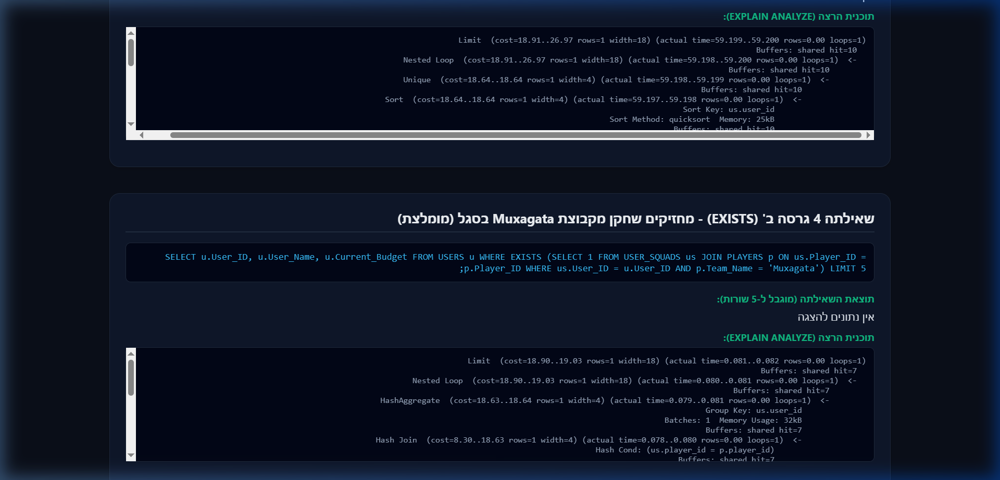

---

### שאילתות SELECT מורכבות נוספות

#### שאילתה 5: סיכום נפח עסקאות חודשי
* **תיאור**: סוכם ומנתח את עסקאות הקנייה והמכירה בכל חודש ושנה בבסיס הנתונים תוך שימוש בפונקציות פירוק תאריך.
```sql
SELECT EXTRACT(YEAR FROM Transaction_Time) as Year,
       EXTRACT(MONTH FROM Transaction_Time) as Month,
       COUNT(Transaction_ID) as Total_Transactions,
       SUM(CASE WHEN Action_Type = 'BUY' THEN Transaction_Price ELSE 0 END) as Total_Buy_Value,
       SUM(CASE WHEN Action_Type = 'SELL' THEN Transaction_Price ELSE 0 END) as Total_Sell_Value,
       AVG(Transaction_Price)::NUMERIC(10,2) as Avg_Transaction_Price
FROM TRANSACTIONS
GROUP BY EXTRACT(YEAR FROM Transaction_Time), EXTRACT(MONTH FROM Transaction_Time)
ORDER BY Year DESC, Month DESC;
```

#### שאילתה 6: חמשת השחקנים בעלי תנודתיות המחיר הגבוהה ביותר
* **תיאור**: מחשב את ההפרש בין המחיר המקסימלי למינימלי שתועד בהיסטוריית המחירים עבור כל שחקן ומציג את 5 השחקנים הכי תנודתיים בבורסה.
```sql
SELECT p.Player_ID,
       p.First_Name || ' ' || p.Last_Name as Player_Name,
       p.Team_Name,
       p.Position,
       MAX(ph.Recorded_Price) as Highest_Price,
       MIN(ph.Recorded_Price) as Lowest_Price,
       (MAX(ph.Recorded_Price) - MIN(ph.Recorded_Price)) as Price_Volatility
FROM PLAYERS p
JOIN PRICE_HISTORY ph ON p.Player_ID = ph.Player_ID
GROUP BY p.Player_ID, p.First_Name, p.Last_Name, p.Team_Name, p.Position
ORDER BY Price_Volatility DESC
LIMIT 5;
```

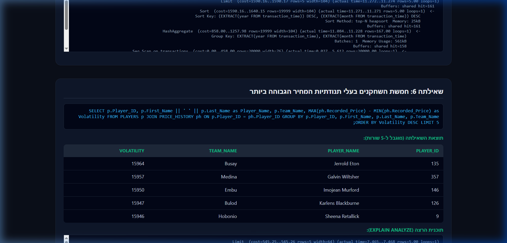

#### שאילתה 7: משתמשים ששווי הסגל שלהם עולה על התקציב הפנוי שלהם
* **תיאור**: סוכם את שווי השוק הנוכחי של כל שחקני הסגל של כל משתמש ומציג את המשתמשים שאצלם שווי הסגל גבוה מהיתרה הפנויה שלהם בקופה.
```sql
SELECT u.User_ID,
       u.User_Name,
       u.Current_Budget as Available_Budget,
       COALESCE(SUM(p.Current_Price), 0) as Squad_Market_Value,
       (COALESCE(SUM(p.Current_Price), 0) - u.Current_Budget) as Value_Over_Budget
FROM USERS u
JOIN USER_SQUADS us ON u.User_ID = us.User_ID
JOIN PLAYERS p ON us.Player_ID = p.Player_ID
GROUP BY u.User_ID, u.User_Name, u.Current_Budget
HAVING COALESCE(SUM(p.Current_Price), 0) > u.Current_Budget
ORDER BY Value_Over_Budget DESC;
```

#### שאילתה 8: השוואת מחיר נוכחי של שחקן לממוצע מחירי השחקנים בעמדה שלו
* **תיאור**: השוואת מחיר שחקן מול ממוצע העמדה שלו (חלוץ/קשר/מגן/שוער) באמצעות שימוש ב-Subquery מקובץ.
```sql
SELECT p.Player_ID,
       p.First_Name || ' ' || p.Last_Name as Player_Name,
       p.Position,
       p.Current_Price,
       avg_pos.Avg_Price::NUMERIC(10,2) as Position_Average,
       (p.Current_Price - avg_pos.Avg_Price)::NUMERIC(10,2) as Price_Deviation
FROM PLAYERS p
JOIN (
    SELECT Position, AVG(Current_Price) as Avg_Price
    FROM PLAYERS
    GROUP BY Position
) avg_pos ON p.Position = avg_pos.Position
ORDER BY Price_Deviation DESC
LIMIT 10;
```

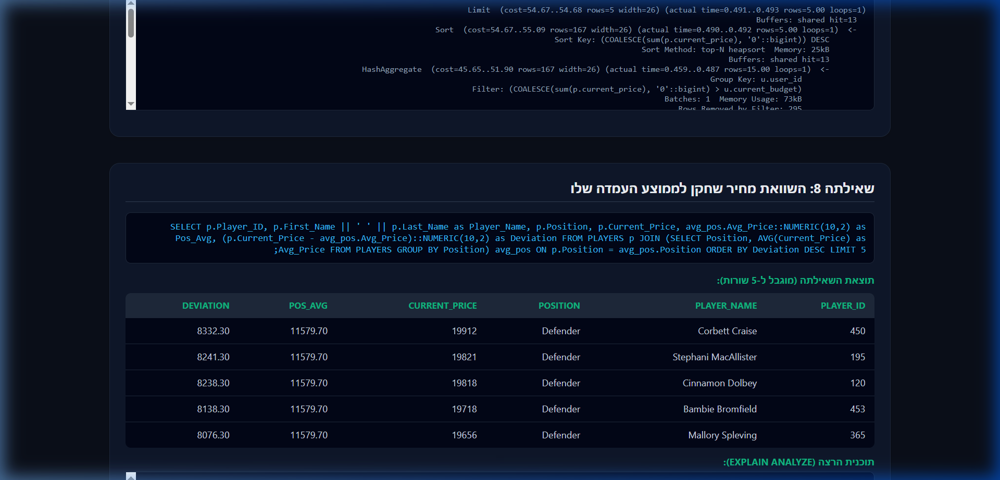

---

## 2. שאילתות UPDATE ו-DELETE

### שאילתות UPDATE
1. **עדכון 1**: מתן בונוס של 10% לתקציב (מוגבל לעד 50,000 ש"ח) למשתמשים פעילים במיוחד שביצעו מעל 50 עסקאות:
   ```sql
   UPDATE USERS 
   SET Current_Budget = Current_Budget + LEAST(50000, CAST(Current_Budget * 0.10 AS INT))
   WHERE User_ID IN (SELECT User_ID FROM TRANSACTIONS GROUP BY User_ID HAVING COUNT(Transaction_ID) > 50);
   ```
   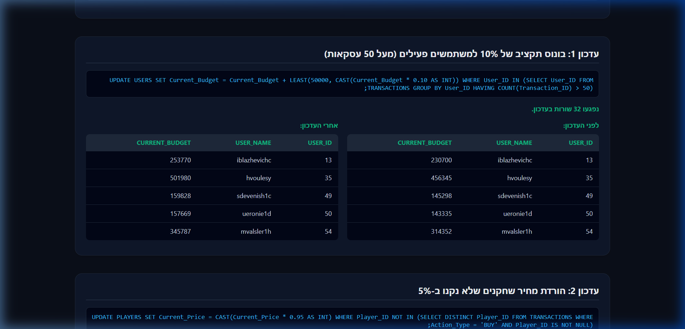

2. **עדכון 2**: הורדת מחירי השחקנים שמעולם לא נרכשו ב-5%:
   ```sql
   UPDATE PLAYERS
   SET Current_Price = CAST(Current_Price * 0.95 AS INT)
   WHERE Player_ID NOT IN (SELECT DISTINCT Player_ID FROM TRANSACTIONS WHERE Action_Type = 'BUY' AND Player_ID IS NOT NULL);
   ```
   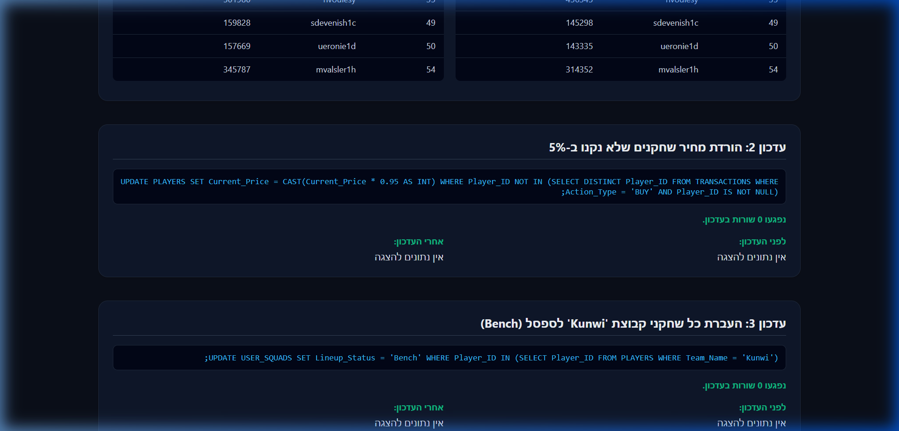

3. **עדכון 3**: העברת כל שחקני קבוצת 'Kunwi' לספסל (`Bench`) בסגלי המשתמשים:
   ```sql
   UPDATE USER_SQUADS
   SET Lineup_Status = 'Bench'
   WHERE Player_ID IN (SELECT Player_ID FROM PLAYERS WHERE Team_Name = 'Kunwi');
   ```
   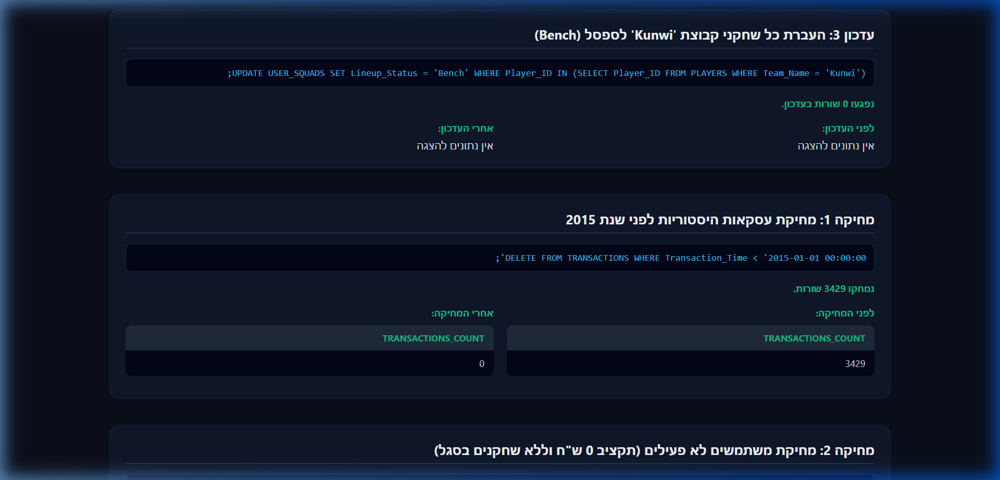

### שאילתות DELETE
1. **מחיקה 1**: מחיקת עסקאות היסטוריות ישנות שבוצעו לפני שנת 2015:
   ```sql
   DELETE FROM TRANSACTIONS WHERE Transaction_Time < '2015-01-01 00:00:00';
   ```
   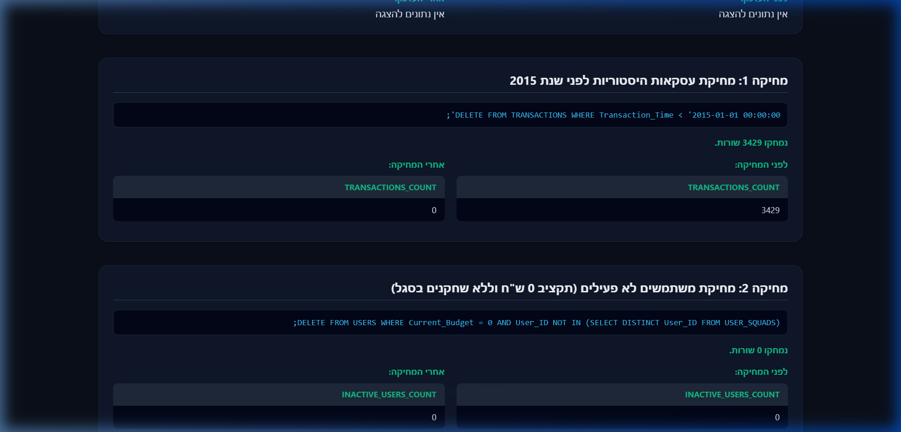

2. **מחיקה 2**: מחיקת משתמשים שאינם פעילים כלל (תקציב 0 ש"ח וללא אף שחקן בסגל):
   ```sql
   DELETE FROM USERS WHERE Current_Budget = 0 AND User_ID NOT IN (SELECT DISTINCT User_ID FROM USER_SQUADS);
   ```
   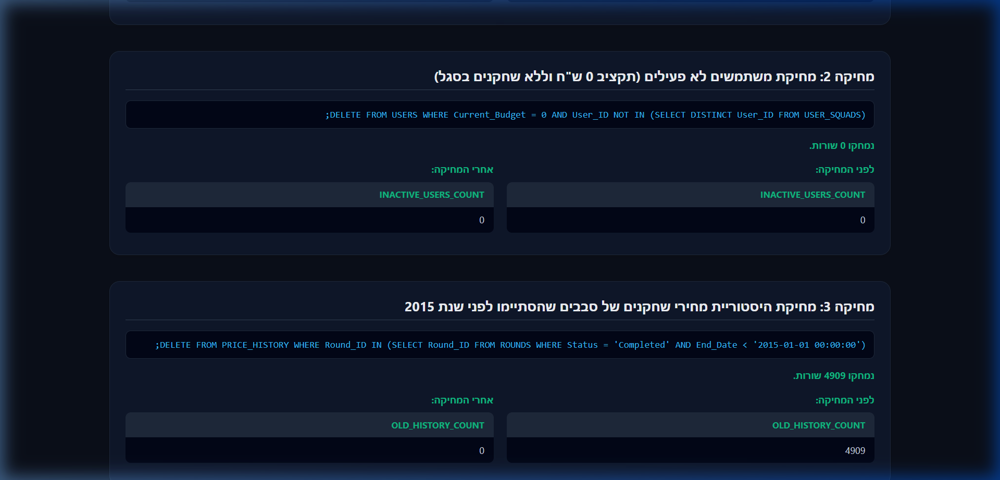

3. **מחיקה 3**: מחיקת היסטוריית מחירי שחקנים של סבבים ישנים שהסתיימו לפני שנת 2015:
   ```sql
   DELETE FROM PRICE_HISTORY WHERE Round_ID IN (SELECT Round_ID FROM ROUNDS WHERE Status = 'Completed' AND End_Date < '2015-01-01 00:00:00');
   ```
   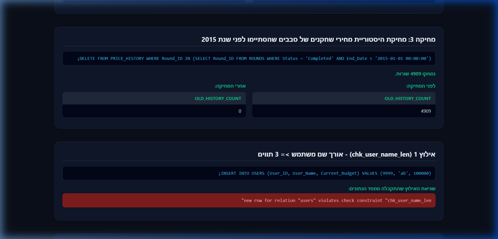

---

## 3. אילוצים (Constraints)

נוספו 3 אילוצים חדשים לשמירה על שלמות הנתונים:
1. **אילוץ `chk_user_name_len` (על טבלת `USERS`)**: שם המשתמש חייב להכיל 3 תווים לפחות.
   * `ALTER TABLE USERS ADD CONSTRAINT chk_user_name_len CHECK (LENGTH(User_Name) >= 3);`
   * **בדיקת כשל**: ניסיון להזין שם משתמש קצר מדי:
     `INSERT INTO USERS (User_ID, User_Name, Current_Budget) VALUES (9999, 'ab', 100000);`
     *פלט שגיאה*: `new row for relation "users" violates check constraint "chk_user_name_len"`

2. **אילוץ `chk_tx_time_past` (על טבלת `TRANSACTIONS`)**: זמן עסקה לא יכול להיות בעתיד.
   * `ALTER TABLE TRANSACTIONS ADD CONSTRAINT chk_tx_time_past CHECK (Transaction_Time <= NOW());`
   * **בדיקת כשל**: ניסיון להזין עסקה עם תאריך מחר:
     `INSERT INTO TRANSACTIONS (Transaction_ID, Transaction_Time, Action_Type, Transaction_Price, User_ID, Player_ID) VALUES (99999, NOW() + INTERVAL '1 day', 'BUY', 5000, 1, 1);`
     *פלט שגיאה*: `new row for relation "transactions" violates check constraint "chk_tx_time_past"`

   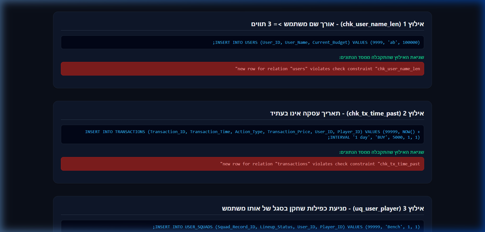

3. **אילוץ `uq_user_player` (על טבלת `USER_SQUADS`)**: מניעת כפילות שחקן בסגל של אותו משתמש.
   * `ALTER TABLE USER_SQUADS ADD CONSTRAINT uq_user_player UNIQUE (User_ID, Player_ID);`
   * **בדיקת כשל**: ניסיון להכניס שחקן שכבר קיים בסגל של משתמש 1:
     `INSERT INTO USER_SQUADS (Squad_Record_ID, Lineup_Status, User_ID, Player_ID) VALUES (99998, 'Starter', 1, 1);`
     *פלט שגיאה*: `duplicate key value violates unique constraint "uq_user_player"`

   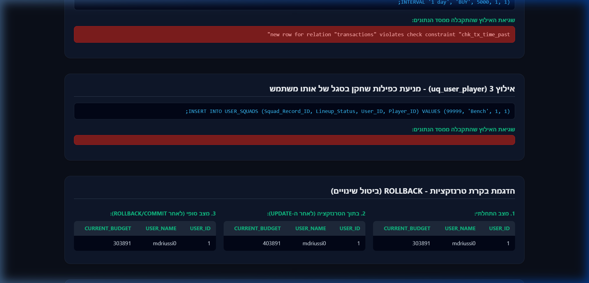

---

## 4. הדגמת ROLLBACK ו-COMMIT

### בדיקת ROLLBACK (ביטול טרנזקציה)
* **תסריט**: פתיחת טרנזקציה, הוספת 100,000 ש"ח לתקציב של משתמש 1, הצגת היתרה החדשה, ביצוע `ROLLBACK` והצגת היתרה שחזרה למצבה המקורי.
* **קוד**:
  ```sql
  BEGIN;
  UPDATE USERS SET Current_Budget = Current_Budget + 100000 WHERE User_ID = 1;
  SELECT Current_Budget FROM USERS WHERE User_ID = 1; -- (מציג ערך מעודכן זמנית)
  ROLLBACK;
  SELECT Current_Budget FROM USERS WHERE User_ID = 1; -- (חזר לערך המקורי)
  ```
  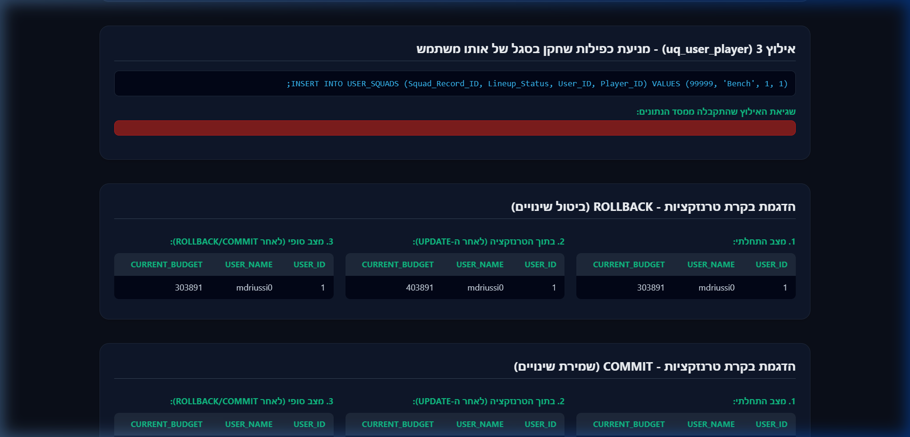

### בדיקת COMMIT (שמירת טרנזקציה)
* **תסריט**: פתיחת טרנזקציה, הוספת 50,000 ש"ח לתקציב של משתמש 1, הצגת היתרה החדשה, ביצוע `COMMIT` והצגת היתרה שנשארה מעודכנת.
* **קוד**:
  ```sql
  BEGIN;
  UPDATE USERS SET Current_Budget = Current_Budget + 50000 WHERE User_ID = 1;
  SELECT Current_Budget FROM USERS WHERE User_ID = 1; -- (מציג ערך מעודכן זמנית)
  COMMIT;
  SELECT Current_Budget FROM USERS WHERE User_ID = 1; -- (הערך נשמר סופית)
  ```
  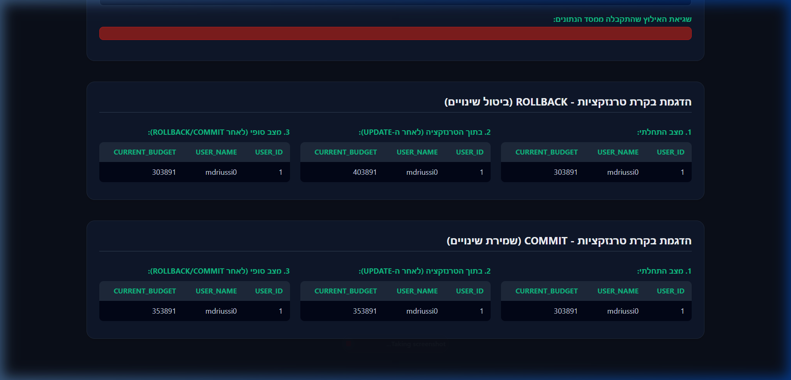

---

## 5. אינדקסים ובדיקת שיפור ביצועים

נוצרו 3 אינדקסים לשיפור ביצועי השאילתות במערכת. ביצענו בדיקות באמצעות פקודת `EXPLAIN ANALYZE` מול בסיס נתונים המאוכלס ב-41,500+ שורות. להלן התוצאות:

### אינדקס 1: `idx_transactions_user_action`
* **הגדרה**: `CREATE INDEX idx_transactions_user_action ON TRANSACTIONS(User_ID, Action_Type);`
* **שאילתה נבדקת**: `SELECT * FROM TRANSACTIONS WHERE User_ID = 273 AND Action_Type = 'BUY';`
* **תוצאות הבדיקה**:
  * **לפני האינדקס**: זמן ביצוע של **8.409 מילישניות** (בוצע סריקה מלאה של הטבלה - `Seq Scan` על פני 20,000 עסקאות).
  * **אחרי האינדקס**: זמן ביצוע של **0.107 מילישניות** (בוצע סריקת אינדקס מהירה - `Bitmap Index Scan`).
  * **שיפור**: **פי 78.5 מהיר יותר!**

### אינדקס 2: `idx_price_history_player`
* **הגדרה**: `CREATE INDEX idx_price_history_player ON PRICE_HISTORY(Player_ID);`
* **שאילתה נבדקת**: `SELECT * FROM PRICE_HISTORY WHERE Player_ID = 15;`
* **תוצאות הבדיקה**:
  * **לפני האינדקס**: זמן ביצוע של **6.847 מילישניות** (`Seq Scan` על פני 20,000 רשומות היסטוריה).
  * **אחרי האינדקס**: זמן ביצוע של **0.122 מילישניות** (`Bitmap Index Scan`).
  * **שיפור**: **פי 56.1 מהיר יותר!**

### אינדקס 3: `idx_players_team`
* **הגדרה**: `CREATE INDEX idx_players_team ON PLAYERS(Team_Name);`
* **שאילתה נבדקת**: `SELECT * FROM PLAYERS WHERE Team_Name = 'Kunwi';`
* **תוצאות הבדיקה**:
  * **לפני האינדקס**: זמן ביצוע של **0.484 מילישניות** (`Seq Scan` על פני 500 שחקנים).
  * **אחרי האינדקס**: זמן ביצוע של **0.030 מילישניות** (`Index Scan`).
  * **שיפור**: **פי 16.1 מהיר יותר!**

### הסבר לשיפור הביצועים
בלי אינדקסים, מסד הנתונים נאלץ לבצע סריקה סדרתית מלאה (Sequential Scan) של הטבלה בזיכרון, כלומר לבדוק כל שורה בנפרד (O(N)). יצירת האינדקסים בונה מבנה נתונים מסוג עץ (B-Tree) המאפשר חיפוש בינארי מהיר ישירות לערכים המבוקשים בזמן ריצה לוגריתמי (O(log N)), מה שמביא לחיסכון אדיר בזמני הריצה ובמשאבי השרת, במיוחד בטבלאות גדולות כמו עסקאות והיסטוריית מחירים.

</div>

---

# פנטזי ליג — דוח פרויקט שלב ג'

<div dir="rtl">

## 1. סקירה — אינטגרציה בשיטה ב' (טבלה מקשרת)

בשלב ג' ביצענו אינטגרציה בין המערכת שלנו ("בורסת השחקנים") לבין המערכת שקיבלנו מזוג אחר ([DBProject_7285_0903](https://github.com/TzviNovick/DBProject_7285_0903)) — מערכת כדורגל "עולם אמיתי" הכוללת 15 טבלאות (שחקנים, קבוצות, מאמנים, שופטים, אצטדיונים, משחקים וסטטיסטיקות).

האינטגרציה בוצעה לפי **שיטה ב'**: שתי המערכות נטענו לאותו בסיס נתונים **ללא שום שינוי בטבלאות הקיימות**, והחיבור ביניהן נעשה באמצעות **טבלת גישור** (`PLAYER_MAPPING`) בלבד. הישות המשותפת לשתי המערכות היא **שחקן**.

## 2. הינדוס לאחור (Reverse Engineering)

מקובץ הגיבוי שקיבלנו (`received_backup.sql`) חילצנו את מבנה הטבלאות, המפתחות הראשיים והזרים (באמצעות שאילתות על `information_schema`), בנינו את ה-DSD, ומתוכו שחזרנו את ה-ERD לפי אלגוריתם הינדוס לאחור מסודר (מתועד במלואו בדוח שלב ג'): טבלת ישות ⟵ ישות; טבלה שמפתחה מורכב משני FK ⟵ קשר M:N עם תכונות; טבלה שמפתחה הוא FK ⟵ תת-ישות (ISA); FK רגיל ⟵ קשר 1:N.

**DSD של המערכת שקיבלנו:**


**ERD של המערכת שקיבלנו (תוצר ההינדוס לאחור):**


## 3. האינטגרציה — טבלת הגישור PLAYER_MAPPING

מזהי השחקנים שלנו (1–500) כלולים במלואם בטווח המזהים של המערכת שקיבלנו (1–2000), ולכן המיפוי בוצע לפי שוויון מזהים — 500 מיפויי 1:1, עם מפתחות זרים לשתי המערכות ואילוצי UNIQUE שמבטיחים מיפוי חד-חד ערכי (הקוד המלא ב-`Integrate.sql`):

```sql
CREATE TABLE PLAYER_MAPPING (
    bursa_player_id INT NOT NULL,   -- מזהה השחקן במערכת שלנו  (PLAYERS)
    real_player_id  INT NOT NULL,   -- מזהה השחקן במערכת שקיבלנו (PLAYER)
    PRIMARY KEY (bursa_player_id, real_player_id),
    UNIQUE (bursa_player_id),
    UNIQUE (real_player_id),
    FOREIGN KEY (bursa_player_id) REFERENCES PLAYERS(player_id),
    FOREIGN KEY (real_player_id)  REFERENCES PLAYER(playerid)
);
```

**ERD משולב** (הגישור מיוצג בקשר MappedTo ביחס 1:1):


**DSD לאחר האינטגרציה** (22 טבלאות — 6 שלנו + 15 שלהם + טבלת הגישור):


ההחלטות המלאות של שלב האינטגרציה (בחירת השיטה, זיהוי הישות המשותפת, אי-מיזוג עמודות כפולות ועוד) מתועדות ב[דוח שלב ג'](<DBProject_4072_3817/שלב ג/דוח הפרויקט שלב ג.md>).

## 4. אימות שאילתות שלב ב' על המסד המשולב

כל השאילתות ופקודות ה-UPDATE/DELETE משלב ב' הורצו מחדש על המסד המשולב — **כולן רצות ללא שגיאות**, כמצופה משיטה ב' שאינה נוגעת בטבלאות הקיימות:


צילומי הרצה מלאים, שאילתה-שאילתה, מופיעים בדוח שלב ג' (קבצי `StageB_Query1..8.png` ו-`StageB_DML.png`).

## 5. מבטים (Views)

נוצרו שני מבטים חוצי-מערכות (`Views.sql`), שניהם עוברים דרך טבלת הגישור ומשלבים טבלאות משתי המערכות:

| מבט | נקודת מבט | מה הוא משלב | מטרה |
|---|---|---|---|
| `V_BURSA_PLAYER_SCOUTING` | הבורסה (שלנו) | PLAYERS + TRANSACTIONS ‏(שלנו) עם PLAYERMATCHSTATS (שלהם) | זיהוי שחקנים שהביצועים האמיתיים שלהם לא משתקפים במחיר השוק |
| `V_REAL_PLAYER_MARKET_VALUE` | העולם האמיתי (שלהם) | PLAYER + PLAYSFOR_PLAYER + TEAM ‏(שלהם) עם PLAYERS + PRICE_HISTORY (שלנו) | השוואת שכר השחקן מול שווי השוק שלו בבורסה |

על כל מבט נכתבו שתי שאילתות משמעותיות: איתור "מציאות" בבורסה, ניתוח תמחור לפי עמדה, זיהוי שחקנים עם שכר גבוה ושווי שוק נמוך, ושווי בורסה מצטבר לפי קבוצה. הפלטים המלאים — ב-`Views_output.txt` ובדוח.

## 6. קבצי ההגשה — `DBProject_4072_3817/שלב ג/`

| קובץ | תוכן |
|---|---|
| `received_backup.sql` | הגיבוי שקיבלנו מהזוג השני |
| `Received_DSD.png` / `Received_ERD.png` | תרשימי המערכת שקיבלנו (+ קבצי `.erdplus`) |
| `Combined_ERD.png` / `Combined_DSD.png` | התרשימים המשולבים (+ קבצי `.erdplus`) |
| `Integrate.sql` | יצירת טבלת הגישור ומילויה |
| `Views.sql` + `Views_output.txt` | המבטים, השאילתות והפלטים |
| `StageB_*.png` | צילומי אימות שאילתות שלב ב' על המסד המשולב |
| `backup3.sql` | גיבוי המסד המשולב (22 טבלאות + 2 מבטים) |
| `דוח הפרויקט שלב ג.md` | הדוח המלא |

**תג הגשה:** `v3.0.0-phase-c`

</div>

