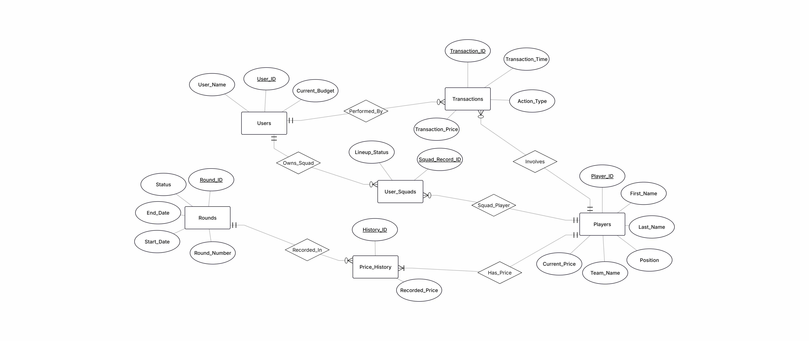
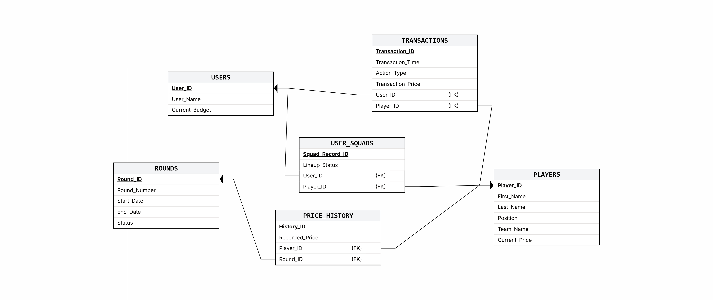
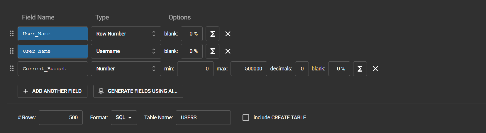

# פנטזי ליג — דוח פרויקט שלב א'

---

## שער

**מגישים:** אביאל כהן, נתנאל דהן

**שם המערכת:** פנטזי ליג

**היחידה הנבחרת:** בורסת השחקנים של הליגה

---

## תוכן עניינים

1. [מבוא](#מבוא)
2. [מסכי המערכת — AI Studio](#מסכי-המערכת--ai-studio)
3. [תרשימי ERD ו-DSD](#תרשימי-erd-ו-dsd)
4. [תיאור הנתונים](#תיאור-הנתונים)
5. [מילון נתונים](#מילון-נתונים)
6. [פונקציונאליות עיקרית](#פונקציונאליות-עיקרית)
7. [מבנה בסיס הנתונים](#מבנה-בסיס-הנתונים)
8. [מבנה תיקיות הפרויקט](#מבנה-תיקיות-הפרויקט)
9. [שיטות הכנסת הנתונים](#שיטות-הכנסת-הנתונים)
10. [גיבוי ושחזור](#גיבוי-ושחזור)
11. [הוראות הרצה](#הוראות-הרצה)

---

## מבוא

פנטזי ליג היא מערכת המדמה בורסת שחקנים בליגת הכדורגל הישראלית.
כל משתמש מתחיל עם תקציב התחלתי ויכול לקנות ולמכור שחקנים בהתאם לביצועיהם בשטח.
ערך כל שחקן משתנה מסבב לסבב בהתאם לנתוניו, בדומה למניה בשוק ההון.

המערכת שומרת את פרטי השחקנים, היסטוריית המחירים לאורך עונה שלמה (36 סבבים), עסקאות הקנייה והמכירה של כל משתמש, והרכב הסגל האישי שלו.

המטרה היא לאפשר למשתמש לנהל תיק השקעות וירטואלי של שחקנים, לעקוב אחר רווח והפסד, ולקבל החלטות קנייה ומכירה מושכלות.

---

## מסכי המערכת — AI Studio

ממשק המשתמש של המערכת עוצב ונוצר בעזרת **Google AI Studio**.
הממשק כולל 4 מסכים עיקריים:

1. **שוק השחקנים** — רשימת כל השחקנים הזמינים לקנייה עם אפשרות סינון לפי עמדה וחיפוש לפי שם
2. **פרופיל שחקן** — דף מפורט לכל שחקן עם סטטיסטיקות וגרף היסטוריית מחיר
3. **הסגל שלי** — ניהול הרכב אישי עם חישוב רווח/הפסד לכל שחקן
4. **היסטוריית עסקאות** — לוג מלא של כל פעולות הקנייה והמכירה

> צילומי מסך מה-AI Studio יתווספו כאן

---

## תרשימי ERD ו-DSD

### ERD


### DSD


---

## תיאור הנתונים

המערכת מנהלת שישה סוגי ישויות מרכזיות:

### משתמשים (USERS)
כל משתמש מזוהה בשם ייחודי ומחזיק תקציב נוכחי. התקציב מתעדכן בכל קנייה או מכירה של שחקן ואינו יכול לרדת מאפס.

### שחקנים (PLAYERS)
כל שחקן מוגדר לפי שם, עמדה (שוער / מגן / קשר / חלוץ), שם הקבוצה שבה הוא משחק, ומחיר עדכני. המחיר נע בטווח קבוע בין 4,000 ל-20,000 יחידות.

### סבבים (ROUNDS)
עונה מורכבת מ-36 סבבים. כל סבב מוגדר בתאריכי התחלה וסיום ובסטטוס שלו (עתידי / פעיל / הסתיים). הסבבים מהווים את ציר הזמן שלפיו מתעדכנים מחירי השחקנים.

### היסטוריית מחירים (PRICE_HISTORY)
לכל שחקן נשמר המחיר שנרשם עבורו בכל סבב. כך ניתן לעקוב אחר מגמות עלייה וירידה בערך השחקן לאורך כל העונה.

### עסקאות (TRANSACTIONS)
כל פעולת קנייה או מכירה של שחקן על ידי משתמש נרשמת עם חותמת זמן, סוג הפעולה, מחיר הביצוע, זהות המשתמש והשחקן. הטבלה מהווה לוג מלא של כל פעילות המסחר.

### סגל אישי (USER_SQUADS)
לכל משתמש ייתכנו מספר שחקנים בסגל. כל שחקן בסגל מוגדר כמחליף (Bench) או שחקן פותח (Starter).

---

## מילון נתונים

### USERS — משתמשים

**מטרה:** שמירת פרטי המשתמשים הרשומים במערכת וניהול התקציב שלהם.

| שם שדה | טיפוס | אילוצים | תיאור |
|--------|--------|---------|-------|
| User_ID | INT | PK, NOT NULL | מזהה ייחודי לכל משתמש |
| User_Name | VARCHAR(50) | NOT NULL | שם המשתמש |
| Current_Budget | INT | NOT NULL, >= 0 | תקציב נוכחי — מתעדכן בכל עסקה |

**קשרים:** משתמש יכול לבצע עסקאות רבות (1:N עם TRANSACTIONS), ויכול להחזיק שחקנים רבים בסגל (1:N עם USER_SQUADS).

---

### PLAYERS — שחקנים

**מטרה:** שמירת פרטי השחקנים הזמינים לסחר בבורסה.

| שם שדה | טיפוס | אילוצים | תיאור |
|--------|--------|---------|-------|
| Player_ID | INT | PK, NOT NULL | מזהה ייחודי לכל שחקן |
| First_Name | VARCHAR(50) | NOT NULL | שם פרטי |
| Last_Name | VARCHAR(50) | NOT NULL | שם משפחה |
| Position | VARCHAR(20) | NOT NULL, IN ('Goalkeeper','Defender','Midfielder','Attacker') | עמדת השחקן |
| Team_Name | VARCHAR(50) | NOT NULL | שם הקבוצה |
| Current_Price | INT | NOT NULL, 4000–20000 | מחיר עדכני בבורסה |

**קשרים:** שחקן מופיע בעסקאות (1:N עם TRANSACTIONS), בהיסטוריית מחירים (1:N עם PRICE_HISTORY), ובסגלי משתמשים (1:N עם USER_SQUADS).

---

### ROUNDS — סבבים

**מטרה:** ייצוג סבבי העונה — ציר הזמן שלפיו מתעדכנים מחירי השחקנים.

| שם שדה | טיפוס | אילוצים | תיאור |
|--------|--------|---------|-------|
| Round_ID | INT | PK, NOT NULL | מזהה ייחודי לסבב |
| Round_Number | INT | NOT NULL, 1–36 | מספר הסבב בעונה |
| Start_Date | TIMESTAMP | NOT NULL | תאריך ושעת תחילת הסבב |
| End_Date | TIMESTAMP | NOT NULL, > Start_Date | תאריך ושעת סיום הסבב |
| Status | VARCHAR(20) | NOT NULL, IN ('Upcoming','Active','Completed') | סטטוס הסבב |

**קשרים:** לכל סבב ייתכנו רשומות רבות בהיסטוריית המחירים (1:N עם PRICE_HISTORY).

---

### PRICE_HISTORY — היסטוריית מחירים

**מטרה:** תיעוד מחיר כל שחקן בכל סבב — מאפשר מעקב אחר מגמות לאורך העונה.

| שם שדה | טיפוס | אילוצים | תיאור |
|--------|--------|---------|-------|
| History_ID | INT | PK, NOT NULL | מזהה ייחודי לרשומה |
| Recorded_Price | INT | NOT NULL, 4000–20000 | המחיר שנרשם לשחקן בסבב זה |
| Player_ID | INT | FK → PLAYERS, NOT NULL | השחקן שאליו שייכת הרשומה |
| Round_ID | INT | FK → ROUNDS, NOT NULL | הסבב שבו נרשם המחיר |

**קשרים:** ישות מקשרת בין PLAYERS ל-ROUNDS (M:N).

---

### TRANSACTIONS — עסקאות

**מטרה:** לוג מלא של כל פעולות הקנייה והמכירה של שחקנים על ידי משתמשים.

| שם שדה | טיפוס | אילוצים | תיאור |
|--------|--------|---------|-------|
| Transaction_ID | INT | PK, NOT NULL | מזהה ייחודי לעסקה |
| Transaction_Time | TIMESTAMP | NOT NULL | חותמת זמן של ביצוע העסקה |
| Action_Type | VARCHAR(10) | NOT NULL, IN ('BUY','SELL') | סוג הפעולה |
| Transaction_Price | INT | NOT NULL, 4000–20000 | מחיר ביצוע העסקה |
| User_ID | INT | FK → USERS, NOT NULL | המשתמש שביצע את העסקה |
| Player_ID | INT | FK → PLAYERS, NOT NULL | השחקן שנסחר |

**קשרים:** ישות מקשרת בין USERS ל-PLAYERS (M:N).

---

### USER_SQUADS — סגל אישי

**מטרה:** ניהול הרכב הסגל האישי של כל משתמש — אילו שחקנים בבעלותו ומה סטטוסם.

| שם שדה | טיפוס | אילוצים | תיאור |
|--------|--------|---------|-------|
| Squad_Record_ID | INT | PK, NOT NULL | מזהה ייחודי לרשומת הסגל |
| Lineup_Status | VARCHAR(20) | NOT NULL, IN ('Starter','Bench') | האם שחקן פותח או מחליף |
| User_ID | INT | FK → USERS, NOT NULL | המשתמש הבעלים |
| Player_ID | INT | FK → PLAYERS, NOT NULL | השחקן בסגל |

**קשרים:** ישות מקשרת בין USERS ל-PLAYERS (M:N).

---

## פונקציונאליות עיקרית

- **מסחר בשחקנים** — קנייה ומכירה של שחקנים תוך עדכון תקציב המשתמש בזמן אמת
- **ניהול סגל אישי** — הרכבת קבוצה אישית ושיבוץ שחקנים להרכב הפותח או ספסל החילופים
- **מעקב מחירים** — צפייה בהיסטוריית מחיר של כל שחקן לאורך סבבי העונה
- **היסטוריית עסקאות** — תיעוד מלא של כל פעולות המסחר עם מועד וסכום לכל עסקה
- **ניהול תקציב** — מעקב אחר יתרת התקציב ומניעת חריגה לחובה

---

## מבנה בסיס הנתונים

```
USERS
├── User_ID        INT  (PK)
├── User_Name      VARCHAR(50)
└── Current_Budget INT  (>= 0)

PLAYERS
├── Player_ID      INT  (PK)
├── First_Name     VARCHAR(50)
├── Last_Name      VARCHAR(50)
├── Position       VARCHAR(20)  ('Goalkeeper' | 'Defender' | 'Midfielder' | 'Attacker')
├── Team_Name      VARCHAR(50)
└── Current_Price  INT  (4000-20000)

ROUNDS
├── Round_ID       INT  (PK)
├── Round_Number   INT  (1-36)
├── Start_Date     TIMESTAMP
├── End_Date       TIMESTAMP
└── Status         VARCHAR(20)  ('Upcoming' | 'Active' | 'Completed')

PRICE_HISTORY
├── History_ID     INT  (PK)
├── Recorded_Price INT  (4000-20000)
├── Player_ID      INT  (FK -> PLAYERS)
└── Round_ID       INT  (FK -> ROUNDS)

TRANSACTIONS
├── Transaction_ID    INT  (PK)
├── Transaction_Time  TIMESTAMP
├── Action_Type       VARCHAR(10)  ('BUY' | 'SELL')
├── Transaction_Price INT  (4000-20000)
├── User_ID           INT  (FK -> USERS)
└── Player_ID         INT  (FK -> PLAYERS)

USER_SQUADS
├── Squad_Record_ID  INT  (PK)
├── Lineup_Status    VARCHAR(20)  ('Starter' | 'Bench')
├── User_ID          INT  (FK -> USERS)
└── Player_ID        INT  (FK -> PLAYERS)
```

**נתוני הזרעה (Seed Data):**

| טבלה | כמות רשומות |
|------|-------------|
| USERS | 500 |
| PLAYERS | 500 |
| ROUNDS | 504 |
| TRANSACTIONS | 20,000 |
| PRICE_HISTORY | 20,000 |
| USER_SQUADS | 500 |

---

## מבנה תיקיות הפרויקט

```
db-project-ui/
│
├── src/                        # קוד ממשק המשתמש (React + TypeScript)
│   ├── App.tsx                 # הרכיב הראשי — כל לוגיקת הממשק
│   ├── main.tsx                # נקודת כניסה
│   └── index.css               # סגנונות
│
├── init-db/                    # סקריפטי אתחול בסיס הנתונים
│   ├── 01_drop.sql             # מחיקת טבלאות (dropTables)
│   ├── 02_create.sql           # יצירת טבלאות (createTables)
│   ├── 03_players.sql          # נתוני שחקנים (500 רשומות)
│   ├── 04_rounds.sql           # נתוני סבבים (504 רשומות)
│   ├── 05_users.sql            # נתוני משתמשים (500 רשומות)
│   ├── 06_transactions.sql     # עסקאות (20,000 רשומות)
│   ├── 07_price_history.sql    # היסטוריית מחירים (20,000 רשומות)
│   ├── 08_user_squads.sql      # סגלי משתמשים (500 רשומות)
│   └── generate_massive_data.py  # סקריפט Python ליצירת נתונים
│
├── images/                     # תמונות לדוח
│   ├── ERD.png
│   ├── DSD.png
│   ├── mockaroo.png
│   ├── pyton script.png
│   ├── ROUND INSERT.png
│   ├── backup command (1 method).png
│   ├── backup success (1 method).png
│   └── backup success (2 method).png
│
├── backup_2026-06-08.sql       # קובץ גיבוי משורת פקודה
├── docker-compose.yml          # הגדרות Docker (PostgreSQL + PgAdmin)
├── .env                        # משתני סביבה (סיסמאות, שם DB)
└── README.md                   # דוח הפרויקט
```

**הערה לשותף:** הקבצים ב-`init-db/` רצים אוטומטית לפי סדר מספרי כאשר מריצים `docker-compose up -d` בפעם הראשונה. אם כבר הרצת בעבר ורוצה לאפס — הרץ `docker-compose down -v` ואז `docker-compose up -d` מחדש.

---

## שיטות הכנסת הנתונים

השתמשנו בשלוש שיטות שונות להכנסת הנתונים לבסיס הנתונים:

---

### שיטה 1 — הכנסה ידנית עם פקודות INSERT (תיקייה: `DBProject/שלב א/`)

נתוני **ROUNDS** (504 סבבים) הוכנסו ישירות בכתיבת פקודות `INSERT` ידניות לתוך קובץ SQL.
בחרנו בשיטה זו כי לסבבים יש מבנה קבוע ומסודר — תאריכי התחלה וסיום לפי לוח המשחקים, ומספר סבב עולה — שקל לכתוב ולשלוט בו ידנית.

קבצים רלוונטיים: `createTables.sql`, `dropTables.sql`, `selectAll.sql`


---

### שיטה 2 — אתר mockaroo (תיקייה: `DBProject/שלב א/mockarooFiles/`)

נתוני **USERS** ו-**PLAYERS** (500 רשומות כל אחד) נוצרו באמצעות האתר **[mockaroo.com](https://mockaroo.com)**.
הגדרנו בממשק האתר את שמות העמודות, הטיפוסים והאילוצים, ויצאנו קובץ SQL מוכן עם 500 שורות `INSERT` לכל טבלה.

קבצים שנוצרו: `USERS.sql`, `PLAYERS.sql`



---

### שיטה 3 — סקריפט Python (תיקייה: `DBProject/שלב א/Programing/`)

הנתונים הגדולים — **TRANSACTIONS**, **PRICE_HISTORY** ו-**USER_SQUADS** (סה"כ 40,500 רשומות) — נוצרו באמצעות סקריפט Python שכתבנו: `generate_massive_data.py`.

הסקריפט רץ על המחשב המקומי ויצר ישירות קובץ SQL עם פקודות INSERT.

**איך עובד הסקריפט:**
- מגריל תאריכים אקראיים בין 2012 להיום לכל עסקה
- מגריל סוג פעולה (BUY/SELL), מחיר בין 4,000-20,000, ומזהי משתמש ושחקן
- כותב את כל הרשומות כ-`INSERT` אחד גדול לביצועים מיטביים
- מייצר 20,000 עסקאות, 20,000 רשומות היסטוריית מחירים, ו-500 רשומות סגל

```python
# הרצת הסקריפט
python generate_massive_data.py
# פלט: massive_inserts.sql עם 40,500 רשומות
```


---

## גיבוי ושחזור

ביצענו שתי שיטות גיבוי שונות לבסיס הנתונים `fantasy_db`.

**מה נשמר בקובץ הגיבוי?**
קובץ הגיבוי מכיל את כל מה שנחוץ לשחזור מלא של בסיס הנתונים:
- פקודות `CREATE TABLE` עם כל האילוצים וה-FK
- פקודות `INSERT` עם כל הנתונים (500 משתמשים, 500 שחקנים, 20,000 עסקאות וכו')
- הרשאות והגדרות סכמה

כלומר — מריצים את הקובץ על מחשב אחר ומקבלים בסיס נתונים זהה לחלוטין.

---

### שיטה 1 — שורת פקודה (`pg_dump`)

הרצנו את הפקודה הבאה בטרמינל:

```bash
docker exec PostgreSQL_DB pg_dump -U postgres fantasy_db > backup_2026-06-08.sql
```

.png)

.png)

---

### שיטה 2 — PgAdmin (ממשק גרפי)

גיבוי דרך ממשק PgAdmin: לחיצה ימנית על `fantasy_db` ← **Backup...** ← בחירת פורמט ושם קובץ.

.png)

---

## הוראות הרצה

### דרישות מוקדמות
- [Docker Desktop](https://www.docker.com/products/docker-desktop/)

### הפעלת בסיס הנתונים

```bash
docker-compose up -d
```

בסיס הנתונים יאותחל אוטומטית עם כל הטבלאות והנתונים.

### ממשק ניהול — PgAdmin

פתח דפדפן בכתובת **http://localhost:8080**

| שדה | ערך |
|-----|-----|
| Email | admin@admin.com |
| Password | admin |

לאחר הכניסה, הוסף שרת חדש עם הפרטים:

| שדה | ערך |
|-----|-----|
| Host | db |
| Port | 5432 |
| Database | fantasy_db |
| Username | postgres |
| Password | 123456 |

### הפעלת ממשק המשתמש (React)

```bash
npm install
npm run dev
```

הממשק יעלה בכתובת **http://localhost:5173**
