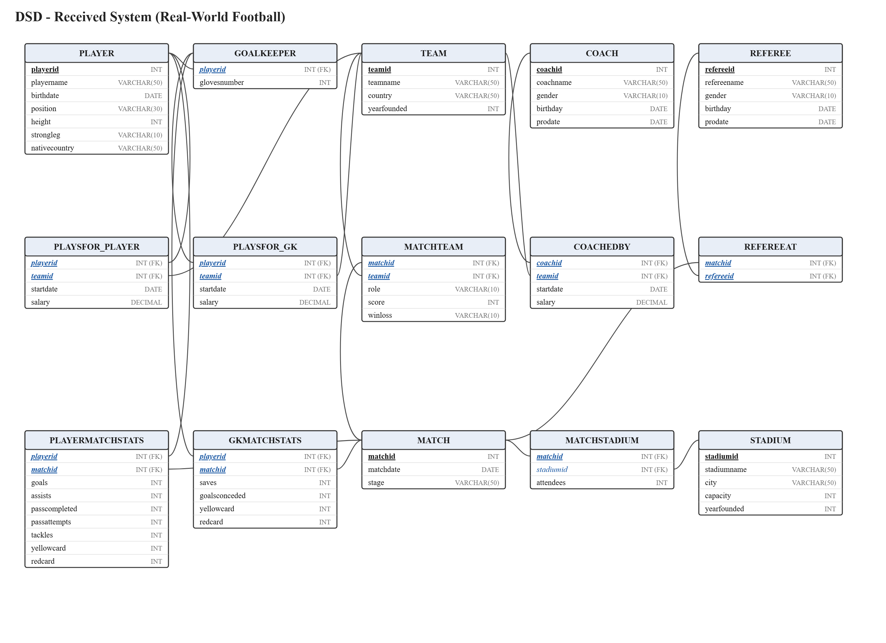
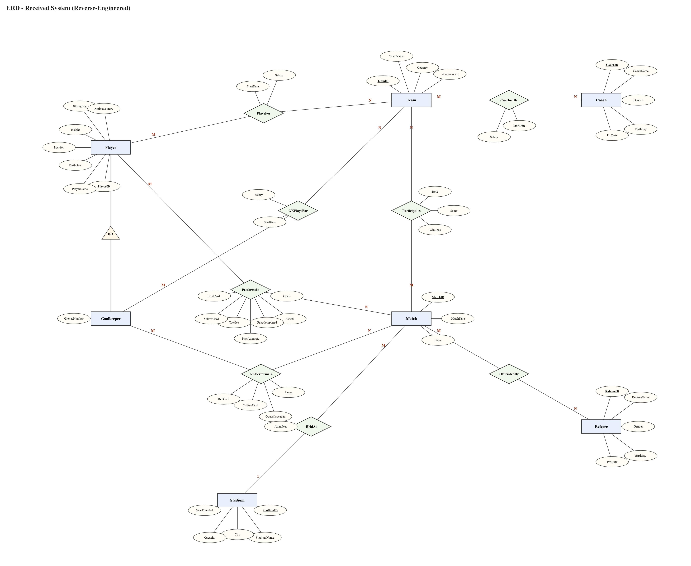
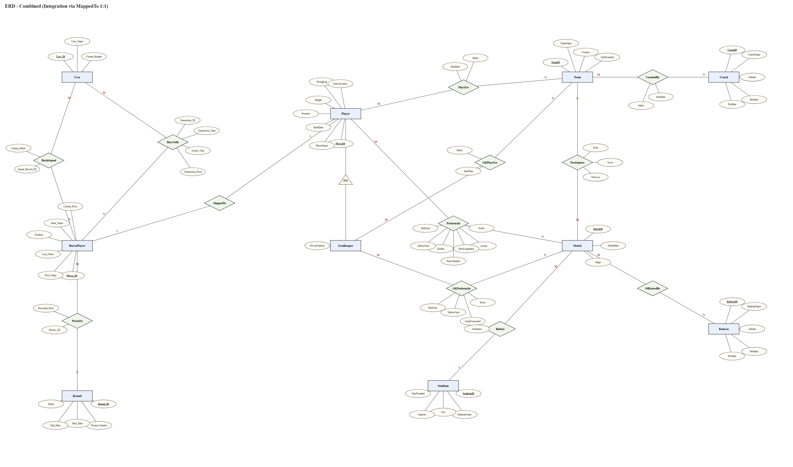
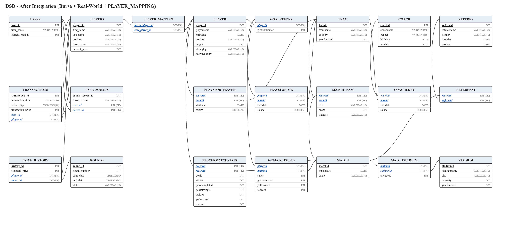
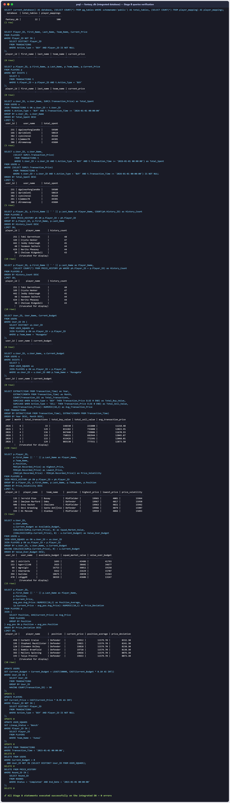

# דוח הפרויקט — שלב ג': אינטגרציה ומבטים

**שיטת האינטגרציה: שיטה ב' — טבלה מקשרת (Bridge Table)**
שתי המערכות נשארות ללא שינוי באותו בסיס נתונים, והחיבור ביניהן מתבצע באמצעות טבלת גישור בלבד. לא בוצע שום `ALTER` על טבלה קיימת.

---

## 1. רקע — שתי המערכות

| | המערכת שלנו | המערכת שקיבלנו |
|---|---|---|
| תחום | בורסת שחקנים (Fantasy Trading) | כדורגל "עולם אמיתי" |
| מקור | `DBProject_4072_3817` | `DBProject_7285_0903` (קובץ `backup2.sql`) |
| טבלאות | USERS, PLAYERS, ROUNDS, PRICE_HISTORY, TRANSACTIONS, USER_SQUADS | PLAYER, GOALKEEPER, COACH, REFEREE, TEAM, STADIUM, MATCH, MATCHTEAM, MATCHSTADIUM, REFEREEAT, COACHEDBY, PLAYSFOR_PLAYER, PLAYSFOR_GK, PLAYERMATCHSTATS, GKMATCHSTATS |

**הישות המשותפת:** שחקן — `PLAYERS(player_id)` אצלנו, `PLAYER(playerid)` אצלם.

---

## 2. הינדוס לאחור (Reverse Engineering)

### 2.1 אלגוריתם ההינדוס לאחור

מתוך קובץ הגיבוי (סכמה + נתונים) מקבלים את ה-DSD, וממנו את ה-ERD, לפי האלגוריתם הבא:

**קלט:** סכמה רלציונית (רשימת טבלאות, עמודות, מפתחות ראשיים וזרים).
**פלט:** תרשים ERD.

1. **חילוץ ה-DSD:** לכל טבלה בגיבוי רושמים את שם הטבלה, עמודותיה, המפתח הראשי (PK) והמפתחות הזרים (FK). בפועל חילצנו זאת משאילתות על `information_schema.columns`, `table_constraints` ו-`key_column_usage`.

2. **סיווג כל טבלה לאחת משלוש קטגוריות:**
   - **טבלת ישות** — טבלה שהמפתח הראשי שלה אינו מורכב ממפתחות זרים ⟵ הופכת ל**ישות** בתרשים (למשל `player`, `team`, `match`).
   - **טבלת קשר M:N** — טבלה שהמפתח הראשי שלה מורכב משני מפתחות זרים ⟵ הופכת ל**קשר יהלום** בין שתי הישויות, כאשר שאר העמודות הופכות ל**תכונות הקשר** (למשל `playsfor_player`, `matchteam`, `refereeat`).
   - **טבלת תת-ישות (ISA)** — טבלה שהמפתח הראשי שלה הוא בעצמו מפתח זר לטבלת ישות אחרת ⟵ הופכת ל**תת-ישות** בהיררכיית הכללה (למשל `goalkeeper`, שה-PK שלה `playerid` הוא FK ל-`player`).

3. **קביעת קשרי 1:N:** מפתח זר שאינו חלק מהמפתח הראשי מעיד על קשר 1:N בין הטבלה המחזיקה (צד Many) לטבלה המוצבעת (צד One). למשל: ב-`matchstadium` המפתח הראשי הוא `matchid` בלבד ו-`stadiumid` הוא FK רגיל ⟵ כל משחק מתקיים באצטדיון **אחד**, ובאצטדיון מתקיימים **הרבה** משחקים ⟵ קשר `HeldAt` מסוג N:1 עם התכונה `attendees`.

4. **מיפוי עמודות לתכונות:** כל עמודה שאינה FK הופכת לתכונה של הישות/הקשר; עמודת ה-PK מסומנת כתכונת מפתח (Unique).

5. **אימות מול הנתונים:** בודקים שהקרדינליות שהוסקה מהמבנה מתיישבת עם הנתונים בפועל (למשל ספירת ערכים ייחודיים בעמודות FK).

### 2.2 תוצאת ההינדוס — המערכת שקיבלנו

**ישויות:** Player *(סופר-טייפ)*, Goalkeeper *(תת-ישות של Player)*, Coach, Referee, Team, Stadium, Match.

**קשרים:**

| קשר | בין | קרדינליות | תכונות | טבלת מקור |
|---|---|---|---|---|
| PlaysFor | Player–Team | M:N | StartDate, Salary | `playsfor_player` |
| GKPlaysFor | Goalkeeper–Team | M:N | StartDate, Salary | `playsfor_gk` |
| CoachedBy | Team–Coach | M:N | StartDate, Salary | `coachedby` |
| PerformsIn | Player–Match | M:N | Goals, Assists, PassCompleted, PassAttempts, Tackles, YellowCard, RedCard | `playermatchstats` |
| GKPerformsIn | Goalkeeper–Match | M:N | Saves, GoalsConceded, YellowCard, RedCard | `gkmatchstats` |
| Participates | Match–Team | M:N | Role, Score, WinLoss | `matchteam` |
| OfficiatedBy | Match–Referee | M:N | — | `refereeat` |
| HeldAt | Match–Stadium | N:1 | Attendees | `matchstadium` |
| ISA | Goalkeeper ⊂ Player | — | — | `goalkeeper` |

**תרשים DSD של האגף החדש:**



**תרשים ERD של האגף החדש (תוצר ההינדוס לאחור):**



---

## 3. החלטות שהתקבלו בשלב האינטגרציה

1. **בחירת שיטה ב' — טבלה מקשרת:** בהתאם להנחיית המרצה. שתי המערכות ממשיכות לתפקד באופן עצמאי מלא, וכל האינטגרציה מתמצה בטבלת גישור אחת (`PLAYER_MAPPING`). יתרונות: אפס סיכון לשבירת המערכות הקיימות, כל שאילתות שלב ב' ממשיכות לעבוד כמות שהן, וכל אחת מהמערכות יכולה להתעדכן בנפרד.

2. **זיהוי הישות המשותפת:** הישות היחידה המשותפת לשתי המערכות היא **שחקן**. שאר הישויות (משתמשים/מחזורים אצלנו; קבוצות/מאמנים/שופטים/אצטדיונים/משחקים אצלם) ייחודיות לכל מערכת ואינן דורשות קישור.

3. **מיפוי לפי שוויון מזהים:** בדיקת הנתונים העלתה שכל 500 מזהי השחקנים שלנו (1–500) כלולים בטווח המזהים של המערכת שקיבלנו (1–2000). לכן המיפוי בוצע לפי `player_id = playerid` — באותו אופן בדיוק שבו הזוג השני מיפה מול המערכת שלנו (`WHERE PersonID <= 500` אצלם). כך נשמרת עקביות דו-כיוונית בין שני הפרויקטים.

4. **מיפוי חד-חד ערכי (1:1):** הוגדרו אילוצי `UNIQUE` על כל אחת מעמודות המיפוי בנפרד, כך שכל שחקן בורסה ממופה לכל היותר לשחקן עולם-אמיתי אחד ולהפך.

5. **אי-מיזוג עמודות כפולות:** עמודת `position` קיימת בשתי המערכות בערכים שונים (אצלנו: Goalkeeper/Defender/Midfielder/Attacker; אצלם: Forward/Defender/Midfielder/...). הוחלט **לא** למזג ולא ליישר את הערכים — כל מערכת שומרת על אמת הנתונים שלה, והמבטים חושפים את שתי הגרסאות זו לצד זו.

6. **טבלאות ריקות נשמרו:** בגיבוי שקיבלנו הטבלאות `goalkeeper`, `gkmatchstats` ו-`playsfor_gk` ריקות (0 רשומות). הן נשמרו במבנה המשולב כפי שהן — הן חלק מהסכמה של האגף שקיבלנו ועשויות להתמלא בעתיד.

**תרשים ERD משולב:**



**תרשים DSD לאחר האינטגרציה:**



---

## 4. הסבר מילולי של התהליך והפקודות

העבודה בוצעה מול PostgreSQL הרץ בקונטיינר Docker בשם `PostgreSQL_DB` (בסיס הנתונים `fantasy_db`).

**שלב 1 — שחזור המערכת שלנו:** ודאנו שבסיס הנתונים שלנו מלא (6 טבלאות, 500 שחקנים, 20,000 עסקאות):

```powershell
docker cp backup_2026-06-08.sql PostgreSQL_DB:/tmp/our_backup.sql
docker exec PostgreSQL_DB psql -U postgres -d fantasy_db -f /tmp/our_backup.sql
```

**שלב 2 — טעינת הגיבוי שקיבלנו:** קובץ `received_backup.sql` (הוא `Stage B/backup2.sql` מהריפו של הזוג השני) נטען **לתוך אותו בסיס נתונים**, לצד הטבלאות שלנו. מאחר שאין התנגשות בשמות הטבלאות, הטעינה עברה נקי ונוצרו 15 טבלאות חדשות:

```powershell
docker cp received_backup.sql PostgreSQL_DB:/tmp/received.sql
docker exec PostgreSQL_DB psql -U postgres -d fantasy_db -v ON_ERROR_STOP=1 -f /tmp/received.sql
```

לאחר הטעינה — 21 טבלאות במסד, כולן עם נתונים (למעט 3 טבלאות ה-goalkeeper שהגיעו ריקות מהמקור):

| טבלה | רשומות | טבלה | רשומות |
|---|---|---|---|
| players (שלנו) | 500 | player (שלהם) | 2,000 |
| users | 500 | playermatchstats | 16,000 |
| transactions | 20,000 | match | 500 |
| price_history | 20,000 | matchteam | 1,000 |
| rounds | 504 | playsfor_player | 2,000 |
| user_squads | 500 | team / coach / referee | 100 / 100 / 100 |
| | | stadium / matchstadium / refereeat | 500 / 500 / 500 |

**שלב 3 — יצירת טבלת הגישור (`Integrate.sql`):** יצירת `PLAYER_MAPPING` עם מפתח ראשי מורכב, אילוצי UNIQUE ומפתחות זרים לשתי המערכות, ומילויה ב-500 מיפויים לפי שוויון מזהים:

```powershell
docker exec PostgreSQL_DB psql -U postgres -d fantasy_db -v ON_ERROR_STOP=1 -f /tmp/integrate.sql
```

פלט: `CREATE TABLE`, `INSERT 0 500`, ואימות `mapping_rows = 500`.

**שלב 4 — אימות שאילתות שלב ב':** כל השאילתות מקובץ `שלב ב/Queries.sql` הורצו מחדש על המסד המשולב — **כולן רצות ללא שגיאות**, כמצופה משיטה ב' (אף טבלה קיימת לא שונתה). בצילום הבא רואים את הריצה המלאה: בראש הפלט שאילתת אימות שמוכיחה שמדובר במסד המשולב (`fantasy_db`, ‏22 טבלאות, 500 מיפויים ב-`PLAYER_MAPPING`), ואחריה כל שאילתות ה-SELECT ופקודות ה-UPDATE/DELETE של שלב ב' עם הפלט שלהן (טבלאות ארוכות קוצרו לתצוגה):



**שלב 5 — מבטים (`Views.sql`):** נוצרו שני מבטים (פירוט בסעיף 5) והורצו השאילתות עליהם.

**שלב 6 — גיבוי:** נוצר `backup3.sql` של המסד המשולב (22 טבלאות + 2 מבטים):

```powershell
docker exec PostgreSQL_DB pg_dump -U postgres -d fantasy_db --no-owner -f /tmp/backup3.sql
docker cp PostgreSQL_DB:/tmp/backup3.sql "שלב ג/backup3.sql"
```

---

## 5. מבטים (Views)

### מבט 1: `V_BURSA_PLAYER_SCOUTING` — נקודת המבט של האגף שלנו (הבורסה)

**תיאור מילולי:** לכל שחקן הנסחר בבורסה, המבט מציג את נתוני השוק שלו מהמערכת שלנו (מחיר נוכחי, נפח מסחר, מחיר עסקה ממוצע) לצד נתוני הביצועים שלו בעולם האמיתי מהמערכת שקיבלנו (משחקים, שערים, בישולים, תיקולים), דרך טבלת הגישור. המבט משלב את הטבלאות: `PLAYERS`, `TRANSACTIONS` (שלנו) + `PLAYERMATCHSTATS` (שלהם) + `PLAYER_MAPPING`. מטרתו: לאפשר לסוחרים לזהות שחקנים שהביצועים האמיתיים שלהם אינם משתקפים במחיר השוק.

**שליפת נתונים — ‏`SELECT * FROM V_BURSA_PLAYER_SCOUTING ORDER BY player_id LIMIT 10;`**

```
 player_id |     bursa_name     |  position  | current_price | trade_volume | avg_tx_price | matches_played | total_goals | total_assists | total_tackles
-----------+--------------------+------------+---------------+--------------+--------------+----------------+-------------+---------------+---------------
         1 | Mile Goodbairn     | Goalkeeper |         10663 |           36 |     11361.69 |              8 |           8 |             5 |            22
         2 | Ruperto Furmage    | Midfielder |         16981 |           30 |     12163.60 |              8 |           9 |             3 |            14
         3 | Nevil Trayhorn     | Defender   |         12587 |           39 |     12271.82 |              8 |           4 |             3 |            23
         4 | Debora Stirland    | Defender   |         15923 |           28 |     11538.89 |              8 |           9 |             3 |            26
         5 | Regina Scandroot   | Midfielder |         11137 |           23 |     13481.83 |              8 |           9 |             3 |            14
         6 | Bette Bazylets     | Defender   |         14366 |           33 |     11306.06 |              8 |           6 |             6 |            20
         7 | Sophronia Walewski | Attacker   |         10828 |           29 |     12539.83 |              8 |           7 |             3 |            21
         8 | Yoshi McMichan     | Attacker   |          7568 |           27 |     12245.07 |              8 |           9 |             5 |            18
         9 | Sheena Retallick   | Defender   |         15092 |           30 |     12269.53 |              8 |           9 |             6 |            14
        10 | Alaster Coolson    | Defender   |         10229 |           35 |     13217.89 |              8 |          10 |             2 |            21
(10 rows)
```

#### שאילתה 1.1 — "מציאות" בבורסה (Undervalued Players)

**תיאור מילולי:** איתור שחקנים שמחירם הנוכחי נמוך מהמחיר הממוצע בבורסה אך תרומתם ההתקפית בעולם האמיתי (שערים + בישולים) גבוהה (15 ומעלה). אלה מועמדים מובילים לקנייה — השוק עדיין לא תמחר את הביצועים שלהם.

```sql
SELECT bursa_name,
       position,
       current_price,
       total_goals + total_assists AS total_contribution,
       matches_played
FROM V_BURSA_PLAYER_SCOUTING
WHERE current_price < (SELECT AVG(current_price) FROM V_BURSA_PLAYER_SCOUTING)
  AND total_goals + total_assists >= 15
ORDER BY total_contribution DESC, current_price ASC
LIMIT 15;
```

**פלט:**

```
    bursa_name    |  position  | current_price | total_contribution | matches_played
------------------+------------+---------------+--------------------+----------------
 Tierney Gyorgy   | Defender   |          4494 |                 18 |              8
 Vonny Van Oord   | Attacker   |          4534 |                 18 |              8
 Korney Lown      | Goalkeeper |          4955 |                 18 |              8
 Kearney Schwier  | Goalkeeper |          5829 |                 18 |              8
 Mame Roberti     | Attacker   |          7304 |                 18 |              8
 Ann Masden       | Midfielder |          9165 |                 18 |              8
 Lita Franssen    | Goalkeeper |          9781 |                 18 |              8
 Stan Leere       | Goalkeeper |          4158 |                 17 |              8
 Valaria Twine    | Defender   |          5952 |                 17 |              8
 Rodie Smitham    | Defender   |          6221 |                 17 |              8
 Marianne Usher   | Attacker   |          8335 |                 17 |              8
 Bradan Souten    | Defender   |          8765 |                 17 |              8
 Carmelle Hadley  | Midfielder |          9470 |                 17 |              8
 Junina Gebbie    | Midfielder |          4052 |                 16 |              8
 Jenda Mapplebeck | Midfielder |          5278 |                 16 |              8
(15 rows)
```

#### שאילתה 1.2 — תמחור לפי עמדה

**תיאור מילולי:** בדיקה האם השוק מתמחר עמדות באופן שמשקף ביצועים: לכל עמדה מחושבים מספר השחקנים, המחיר הממוצע, נפח המסחר הממוצע וממוצע השערים למשחק (מהעולם האמיתי). ניתן לראות שהחלוצים (Attacker) הם היקרים ביותר, אף שממוצע השערים למשחק כמעט זהה בין העמדות — תובנה על הטיית תמחור בשוק.

```sql
SELECT position,
       COUNT(*)                                    AS players_count,
       ROUND(AVG(current_price), 2)                AS avg_price,
       ROUND(AVG(trade_volume), 2)                 AS avg_trade_volume,
       ROUND(AVG(total_goals::numeric / NULLIF(matches_played, 0)), 3) AS avg_goals_per_match
FROM V_BURSA_PLAYER_SCOUTING
GROUP BY position
ORDER BY avg_price DESC;
```

**פלט:**

```
  position  | players_count | avg_price | avg_trade_volume | avg_goals_per_match
------------+---------------+-----------+------------------+---------------------
 Attacker   |           126 |  12045.79 |            32.90 |               1.009
 Goalkeeper |           121 |  11857.98 |            33.39 |               0.999
 Midfielder |           113 |  11760.97 |            32.54 |               1.013
 Defender   |           140 |  11579.70 |            33.63 |               1.001
(4 rows)
```

### מבט 2: `V_REAL_PLAYER_MARKET_VALUE` — נקודת המבט של האגף שקיבלנו (עולם אמיתי)

**תיאור מילולי:** לכל שחקן במערכת העולם האמיתי, המבט מציג את פרטיו, הקבוצה שבה הוא משחק והשכר שלו (מהמערכת שקיבלנו), לצד שווי השוק שלו בבורסה שלנו — מחיר נוכחי וטווח מחירים היסטורי (מהמערכת שלנו), דרך טבלת הגישור. המבט משלב את הטבלאות: `PLAYER`, `PLAYSFOR_PLAYER`, `TEAM` (שלהם) + `PLAYERS`, `PRICE_HISTORY` (שלנו) + `PLAYER_MAPPING`. מטרתו: לאפשר למועדון להשוות בין השכר שהוא משלם לשחקן לבין הערך שהשוק מייחס לו.

**שליפת נתונים — ‏`SELECT * FROM V_REAL_PLAYER_MARKET_VALUE ORDER BY playerid LIMIT 10;`**

```
 playerid |     playername     |  position  | nativecountry |     teamname      |  salary   | bursa_current_price | bursa_min_price | bursa_max_price
----------+--------------------+------------+---------------+-------------------+-----------+---------------------+-----------------+-----------------
        1 | Ruben Gnabry 1     | Forward    | France        | Sweden FC 2       |   5000.00 |               10663 |            4697 |           19613
        2 | Marcus Silva 2     | Forward    | France        | Turkey FC 3       |  72730.00 |               16981 |            4008 |           18959
        3 | Gabriel Gnabry 3   | Defender   | Croatia       | Spain FC 4        |  59007.00 |               12587 |            5126 |           19436
        4 | Ousmane Bastoni 4  | Midfielder | Morocco       | Ivory Coast FC 5  | 122502.00 |               15923 |            4191 |           19237
        5 | Alphonso Alvarez 5 | Defender   | Egypt         | Poland FC 6       | 118933.00 |               11137 |            4781 |           19675
        6 | Alexis Kimmich 6   | Forward    | Austria       | Portugal FC 7     |  47012.00 |               14366 |            4178 |           19558
        7 | Alexis Becker 7    | Midfielder | Brazil        | Morocco FC 8      | 137484.00 |               10828 |            6613 |           19742
        8 | Leroy Camavinga 8  | Defender   | France        | Argentina FC 9    |  95873.00 |                7568 |            4380 |           19777
        9 | Aurelien Foden 9   | Forward    | France        | Netherlands FC 10 |  70501.00 |               15092 |            4181 |           19967
       10 | Erling Messi 10    | Defender   | Colombia      | England FC 11     | 123905.00 |               10229 |            6393 |           19400
(10 rows)
```

#### שאילתה 2.1 — שכר גבוה, שווי שוק נמוך

**תיאור מילולי:** איתור שחקנים ששכרם גבוה מהשכר הממוצע אך שווי הבורסה שלהם נמוך מהחציון — פער שמעיד על סיכון פיננסי למועדון (משלם הרבה על שחקן שהשוק לא מעריך).

```sql
SELECT playername,
       teamname,
       salary,
       bursa_current_price
FROM V_REAL_PLAYER_MARKET_VALUE
WHERE salary > (SELECT AVG(salary) FROM V_REAL_PLAYER_MARKET_VALUE)
  AND bursa_current_price < (SELECT PERCENTILE_CONT(0.5) WITHIN GROUP (ORDER BY bursa_current_price)
                             FROM V_REAL_PLAYER_MARKET_VALUE)
ORDER BY salary DESC
LIMIT 15;
```

**פלט:**

```
       playername       |    teamname    |  salary   | bursa_current_price
------------------------+----------------+-----------+---------------------
 Trent Maignan 31       | Spain FC 32    | 159867.00 |                5218
 Achraf Tchouameni 87   | Spain FC 88    | 158865.00 |                7776
 Trent Tchouameni 462   | Portugal FC 63 | 158320.00 |                9448
 Marquinhos Odegaard 71 | Austria FC 72  | 158061.00 |                4946
 Alisson Silva 315      | Austria FC 16  | 157257.00 |                7787
 Rafael Valverde 281    | Nigeria FC 82  | 157176.00 |                6147
 Bruno Lewandowski 358  | Turkey FC 59   | 156947.00 |                9347
 Virgil Bellingham 42   | Brazil FC 43   | 156892.00 |                6878
 Gabriel Maignan 331    | Spain FC 32    | 156313.00 |                8834
 Eduardo Saliba 278     | France FC 79   | 155998.00 |                7319
 Alexis Rashford 75     | Colombia FC 76 | 155489.00 |               10684
 Ronald Dembele 54      | Scotland FC 55 | 155011.00 |               11393
 Federico Messi 439     | Germany FC 40  | 154697.00 |                4788
 Lautaro Donnarumma 252 | Egypt FC 53    | 154295.00 |                4609
 Federico Tonali 378    | France FC 79   | 153813.00 |               11384
(15 rows)
```

#### שאילתה 2.2 — שווי בורסה מצטבר לפי קבוצה

**תיאור מילולי:** אילו קבוצות בעולם האמיתי מחזיקות את השחקנים היקרים ביותר בבורסה: לכל קבוצה (עם 3 שחקנים ממופים לפחות) מחושבים מספר השחקנים הממופים, המחיר הממוצע, השווי הכולל והתנודתיות הממוצעת של המחיר (מקסימום פחות מינימום היסטורי).

```sql
SELECT teamname,
       COUNT(*)                                     AS mapped_players,
       ROUND(AVG(bursa_current_price), 2)           AS avg_bursa_price,
       SUM(bursa_current_price)                     AS total_bursa_value,
       ROUND(AVG(bursa_max_price - bursa_min_price), 2) AS avg_price_volatility
FROM V_REAL_PLAYER_MARKET_VALUE
GROUP BY teamname
HAVING COUNT(*) >= 3
ORDER BY total_bursa_value DESC
LIMIT 15;
```

**פלט (15 ראשונות):**

```
    teamname    | mapped_players | avg_bursa_price | total_bursa_value | avg_price_volatility
----------------+----------------+-----------------+-------------------+----------------------
 Colombia FC 48 |              5 |        16467.20 |             82336 |             15186.20
 Spain FC 4     |              5 |        16466.40 |             82332 |             15218.00
 Nigeria FC 26  |              5 |        15829.60 |             79148 |             15309.80
 Japan FC 41    |              5 |        15438.20 |             77191 |             15399.60
 Croatia FC 45  |              5 |        15246.60 |             76233 |             14861.60
 Turkey FC 3    |              5 |        15226.60 |             76133 |             14936.40
 Morocco FC 92  |              5 |        15186.60 |             75933 |             15321.20
 Nigeria FC 54  |              5 |        14977.40 |             74887 |             14796.40
 Colombia FC 20 |              5 |        14879.40 |             74397 |             15377.00
 Israel FC 47   |              5 |        14711.00 |             73555 |             15349.80
 Senegal FC 14  |              5 |        14605.00 |             73025 |             15258.00
 Spain FC 88    |              5 |        14235.60 |             71178 |             14266.00
(12 rows)
```

---

## 6. קבצים מוגשים בתיקיית "שלב ג"

| קובץ | תוכן |
|---|---|
| `received_backup.sql` | הגיבוי שקיבלנו מהזוג השני |
| `Received_DSD.erdplus` / `Received_DSD.png` | DSD של האגף החדש |
| `Received_ERD.erdplus` / `Received_ERD.png` | ERD של האגף החדש (הינדוס לאחור) |
| `Combined_ERD.erdplus` / `Combined_ERD.png` | ERD משולב |
| `Combined_DSD.erdplus` / `Combined_DSD.png` | DSD לאחר אינטגרציה |
| `Integrate.sql` | יצירת ומילוי טבלת הגישור |
| `Views.sql` | יצירת המבטים + השאילתות עליהם |
| `Views_output.txt` | פלט מלא של הרצת Views.sql |
| `StageB_Queries_Verification.png` | צילום הרצת שאילתות שלב ב' על המסד המשולב (0 שגיאות) |
| `backup3.sql` | גיבוי המסד המשולב |
| `דוח הפרויקט שלב ג.md` | דוח זה |
